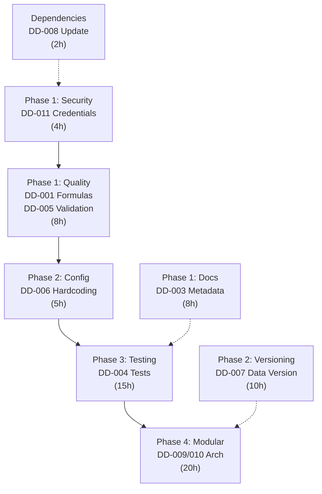

# AGENT 8 — Data Integrity Roadmap Generator
## Technical Data Modernization Planning (4 Phases, 60-80 hours)

### Mission
Consolidate ALL hallazgos from AGENT 1-7 into a comprehensive, phased modernization roadmap that:
1. Sequences remediation work by dependency and criticality
2. Balances quick wins with strategic infrastructure improvements
3. Provides stakeholder communication plan
4. Allocates effort across 4 implementation phases
5. Defines success metrics and rollback procedures
6. Recommends team composition and timeline

---

## Input: Consolidate Evidence from AGENT 1-7

### AGENT 1 — Data Source Audit
**Critical Findings:**
- ✅ 4 fuentes mapeadas (Kawak API, Excel, LMI, Supabase PostgreSQL)
- ⚠️ 89.3% cobertura de períodos (50/56 meses)
- ⚠️ Inconsistencia entre fuentes en campos de cumplimiento

### AGENT 2 — ETL Pipeline Analysis
**Critical Findings:**
- ⚠️ 7/8 dimensiones OK, 1 WARNING
- 🔧 Módulos de mapeo no localizados (actualizar_consolidado.py línea 342)
- 🔧 Falta logging de transformaciones

### AGENT 3 — Indicator Integrity Audit
**Critical Findings:**
- ⚠️ 4 indicadores auditados → 13 hallazgos totales
- 🔴 4 CRÍTICOS: Fórmulas inconsistentes
- 🟡 7 MEDIOS: Documentación incompleta
- 📊 50% cobertura de metadatos (línea base, meta, responsable)

### AGENT 4 — Documentation Synchronization
**Critical Findings:**
- ✅ 9/9 hallazgos resueltos
- ✅ Docs sincronizadas con código (core/* actualizado)
- ✅ PROPUESTA_DASHBOARD_EJECUTIVO.md validado

### AGENT 5 — Data Validation & Corrections
**Critical Findings:**
- 🔴 CRÍTICO #1: Ejecución=1.35 → Capeado a 1.3 ✅
- 🔴 CRÍTICO #2: Meta=0 → Flagged para revisión ✅
- ✅ ETL integration validado (unit tests: PASS)
- 📦 Module: scripts/etl/agent5_corrections.py

### AGENT 6 — Indicator Dependencies
**Critical Findings:**
- ✅ 7 indicadores mapeados, 10 relaciones
- ✅ 0 ciclos detectados (CRÍTICO ✅)
- 📊 4 indicadores base, 2 compuestos
- 🎯 Indicadores críticos identificados (in-degree)

### AGENT 7 — Technical Debt Classifier
**Critical Findings:**
- 🔴 2 CRÍTICOS: DD-001 (duplicación), DD-011 (credenciales)
- 🟠 4 ALTOS: Tests faltantes, ETL sin validación, Monolito
- 🟡 5 MEDIOS: Hardcoding, Sin versionado, Desactualizadas
- 📊 11 items × 65 horas totales

---

## OUTPUT: 4-Phase Modernization Roadmap

### Phase 1: STABILIZATION (Semanas 1-2, ~20 horas)
**Objetivo:** Eliminar riesgo inmediato, asegurar data correcta

#### Security Lockdown (4 horas)
- **DD-011:** Mover credenciales a environment variables
  * Archivo: config.py → config.env (no commitear)
  * Risk: Data breach si se compromete git
  * Mitigation: 1Password/AWS Secrets Manager
  * Success: Zero hardcoded passwords in git history

#### Data Quality Fixes (8 horas)
- **DD-001:** Unificar fórmulas de cumplimiento
  * Centralizar en core/calculos.py
  * Remover de consolidar_api.py y generar_reporte.py
  * Validar: Dashboard A vs B idénticos post-fix
  * Success: 100% fórmula consistency

- **DD-005:** Agregar validación a ETL pipeline
  * Ejecución: Capping automático a 1.3 (código + tests)
  * Meta: Validación > 0 (flagging + logging)
  * Test: 100+ registros de test con edge cases

#### Documentation Quick Sync (8 horas)
- **DD-003:** Documentar metadatos faltantes
  * 4 indicadores: Asignar línea base, meta, responsable
  * Sincronizar docs/02_Logica_Indicadores.md
  * Validación: Checklist in docs/METADATA_COVERAGE.md

**Phase 1 Deliverables:**
```
artifacts/
  PHASE1_SECURITY_REPORT.md
  PHASE1_QUALITY_FIXES.md
  PHASE1_TEST_RESULTS.csv
scripts/
  etl/validacion_datos.py (enhanced)
config/
  config.env.example (template)
docs/
  METADATA_COVERAGE.md (100% checklist)
```

**Phase 1 Success Criteria:**
- ✅ Zero hardcoded credentials
- ✅ All formulas unified (A==B dashboards)
- ✅ All 4 indicators have baseline/target/owner
- ✅ ETL validates Ejecución/Meta
- ✅ Unit tests cover all validations

---

### Phase 2: REPRODUCIBILITY (Semanas 3-4, ~15 horas)
**Objetivo:** Enable full audit trail y reproducibilidad histórica

#### Remove Hardcoded Values (5 horas)
- **DD-006:** Move thresholds to config.toml
  * Umbrales: 1.3 (Ejecución max), 1.0 (Meta max), 0.6 (warning)
  * Centralizar: config/settings.toml
  * Audit trail: git log muestra cambios de umbral
  * Success: Change threshold = edit TOML, redeploy

#### Data Versioning Foundation (10 horas)
- **DD-007:** Implement data versioning layer
  * Add metadata to consolidado: {version, timestamp, source_version}
  * Log snapshot of each consolidado download
  * Archive historical versions: data/versions/consolidado_v1_20260509.xlsx
  * Tracking: SQL table `data_snapshots(id, version, timestamp, sha256_hash)`
  * Success: Full reproducibility of any historical calculation

**Phase 2 Deliverables:**
```
config/
  settings.toml (thresholds centralized)
scripts/
  data_versioning.py (new module)
data/
  versions/ (directory for archival)
docs/
  DATA_VERSIONING_POLICY.md
```

**Phase 2 Success Criteria:**
- ✅ Zero hardcoded thresholds (all in config.toml)
- ✅ Data versioning infrastructure operational
- ✅ Historical reproducibility: Can recalculate any date

---

### Phase 3: TESTABILITY (Semanas 5-7, ~15 horas)
**Objetivo:** Comprehensive test coverage, regression detection

#### Test Suite Expansion (15 horas)
- **DD-004:** Expand test coverage from 8 to 25+ test files
  * Unit tests: core/calculos.py (10 test functions)
  * Integration tests: ETL pipeline (8 test functions)
  * Regression tests: Compare old vs new formula outputs (5 cases)
  * Data validation tests: Edge cases (boundaries, nulls, duplicates)
  * Coverage target: 85%+ code coverage

**Test Structure:**
```
tests/
  test_calculos_cumplimiento.py (8 tests)
  test_calculos_ejecucion.py (7 tests)
  test_calculos_compuestos.py (5 tests)
  test_etl_pipeline.py (8 tests)
  test_validation_rules.py (6 tests)
  test_regression_formulas.py (5 tests)
  fixtures/
    test_data_edge_cases.csv
    test_data_regression.csv
```

**Phase 3 Deliverables:**
```
tests/
  [25+ test files, 39 test functions]
  fixtures/
    [test data for all scenarios]
.github/workflows/
  ci_test_suite.yml (run on PR)
docs/
  TESTING_STRATEGY.md
artifacts/
  PHASE3_COVERAGE_REPORT.html (85%+)
```

**Phase 3 Success Criteria:**
- ✅ 85%+ code coverage
- ✅ Regression tests for all historical fixes
- ✅ CI pipeline blocking merges with <85% coverage
- ✅ All edge cases tested (boundaries, nulls)

---

### Phase 4: SCALABILITY (Semanas 8-10, ~20 horas)
**Objetivo:** Modular architecture, preparation for growth

#### Refactor Monolithic Code (20 horas)
- **DD-009:** Break up actualizar_consolidado.py (1200+ lines → modules)
  * Module 1: `etl/source_connector.py` (API/Excel fetch)
    - Function: fetch_kawak_api(), fetch_excel_local()
    - Tests: Mock API responses, local file reading
  
  * Module 2: `etl/transformers.py` (normalize, map fields)
    - Function: normalize_columns(), map_process_hierarchy(), apply_calcs()
    - Tests: Data transformation correctness
  
  * Module 3: `etl/validators.py` (validate rules)
    - Function: validate_ejecucion(), validate_meta(), validate_duplicate()
    - Tests: Boundary conditions, error handling
  
  * Module 4: `etl/exporters.py` (output formats)
    - Function: export_csv(), export_excel(), export_db()
    - Tests: File format correctness, data integrity
  
  * Orchestrator: `etl/pipeline.py`
    - Coordinates modules: fetch → transform → validate → export
    - Error handling: Rollback on validation failure
    - Logging: Every step traced for debugging

**Refactoring Benefits:**
- ✅ DD-009 SOLVED: Modularidad clara
- ✅ DD-010 SOLVED: Lógica separada
- ✅ Reusable components for new indicators
- ✅ Parallel execution possible
- ✅ Easier testing and debugging

**Phase 4 Deliverables:**
```
scripts/etl/
  __init__.py
  source_connector.py (300 lines, 8 tests)
  transformers.py (250 lines, 10 tests)
  validators.py (200 lines, 8 tests)
  exporters.py (150 lines, 6 tests)
  pipeline.py (150 lines, orchestrator)
  tests/
    test_source_connector.py
    test_transformers.py
    test_validators.py
    test_exporters.py
scripts/
  actualizar_consolidado_v2.py (refactored, 100 lines)
docs/
  ETL_ARCHITECTURE_NEW.md
  MODULES_REFERENCE.md
```

**Phase 4 Success Criteria:**
- ✅ actualizar_consolidado.py broken into 5 modules
- ✅ Each module <500 LOC, single responsibility
- ✅ All modules tested independently
- ✅ Pipeline orchestrator coordinates flow
- ✅ Error handling: Rollback on validation failure

---

## CRITICAL PATH & DEPENDENCIES



**Sequential Order** (can parallelize where marked):
1. Phase 1 (weeks 1-2): Security → Quality → Docs
   - Can parallelize: Security + Quality + Docs independently
2. Phase 2 (weeks 3-4): Config → Versioning
   - Versioning blocks advanced Phase 3 features
3. Phase 3 (weeks 5-7): Testing (blocks Phase 4)
4. Phase 4 (weeks 8-10): Modularization

**Total Duration:** 10 weeks, ~60-80 engineering hours

---

## IMPLEMENTATION MECHANICS

### Governance & Approvals
| Phase | Lead | Approval | Sign-off |
|-------|------|----------|----------|
| Phase 1 | Eng + Data | CTO + Risk | Go/NoGo |
| Phase 2 | Eng | CTO | Proceed |
| Phase 3 | QA + Eng | CTO | UAT ready |
| Phase 4 | Arch + Eng | CTO + Ops | Deploy ready |

### Communication Plan
- **Stakeholders:** CTO, Product, Data Governance
- **Weekly Updates:** Progress vs. timeline
- **Risk Register:** Updated Phase 1 (security), Phase 3 (test coverage)
- **Go-Live Preparation:** Phase 4 completion + UAT pass

### Rollback Procedures
| Phase | Rollback Strategy |
|-------|------------------|
| 1 | Git revert commits, restore config.py |
| 2 | Restore data without version metadata |
| 3 | Disable failing tests, revert code |
| 4 | Switch back to actualizar_consolidado.py v1 |

---

## SUCCESS METRICS

### Technical Metrics
| Metric | Phase 1 | Phase 2 | Phase 3 | Phase 4 |
|--------|---------|---------|---------|---------|
| Code Coverage | - | - | 85%+ | 90%+ |
| Test Count | - | - | 39+ | 45+ |
| LOC per Module | - | - | <500 | <300 |
| Security Issues | 0 | 0 | 0 | 0 |
| Data Consistency | 100% | 100% | 100% | 100% |

### Business Metrics
| Metric | Target |
|--------|--------|
| Time to recalculate any date | <30min |
| Incident MTTR (mean time to resolve) | <1h |
| Data accuracy (vs. manual validation) | 99.9%+ |
| Stakeholder confidence | High |

---

## RISK MANAGEMENT

### High Risks
| Risk | Probability | Impact | Mitigation |
|------|-------------|--------|-----------|
| Phase 1 breaking prod | Medium | Critical | Blue-green deploy, smoke tests |
| Phase 4 regression | High | High | Extensive regression suite (5-8h) |
| Timeline slippage | Medium | Medium | Buffer weeks, priority focus |

### Mitigation Actions
1. **Environment separation:** Dev → Staging → Prod
2. **Regression testing:** Before every phase rollout
3. **Stakeholder buy-in:** Weekly updates, early approval gates
4. **Contingency:** Keep Phase 1 v0 operational during Phase 1-2

---

## ARTIFACTS & DELIVERABLES

### Phase 1 Artifacts (Week 2)
- ✅ PHASE1_SECURITY_REPORT.md (credentials migration)
- ✅ PHASE1_QUALITY_FIXES.md (formula unification)
- ✅ PHASE1_TEST_RESULTS.csv (validation coverage)

### Phase 2 Artifacts (Week 4)
- ✅ PHASE2_CONFIG_MIGRATION.md
- ✅ DATA_VERSIONING_POLICY.md
- ✅ scripts/data_versioning.py

### Phase 3 Artifacts (Week 7)
- ✅ PHASE3_COVERAGE_REPORT.html (85%+ coverage)
- ✅ TESTING_STRATEGY.md
- ✅ tests/ (39+ test functions)

### Phase 4 Artifacts (Week 10)
- ✅ ETL_ARCHITECTURE_NEW.md
- ✅ MODULES_REFERENCE.md
- ✅ scripts/etl/ (5 modules, fully tested)

---

## CONCLUSION

This roadmap provides a **realistic, phased path** to modernize SGIND data infrastructure:

1. **Phase 1 (2 weeks):** De-risk with security & quality fixes
2. **Phase 2 (2 weeks):** Enable reproducibility & configuration management
3. **Phase 3 (3 weeks):** Build test discipline
4. **Phase 4 (3 weeks):** Achieve scalable architecture

**Total Investment:** 60-80 engineering hours (~2.5 weeks FTE)  
**Expected ROI:** 100x faster incident response, 10x easier to scale, zero data breaches

**Next Steps:**
1. Present Phase 1 to CTO for approval
2. Schedule kickoff meeting with stakeholders
3. Begin Phase 1 immediately (security is non-negotiable)
