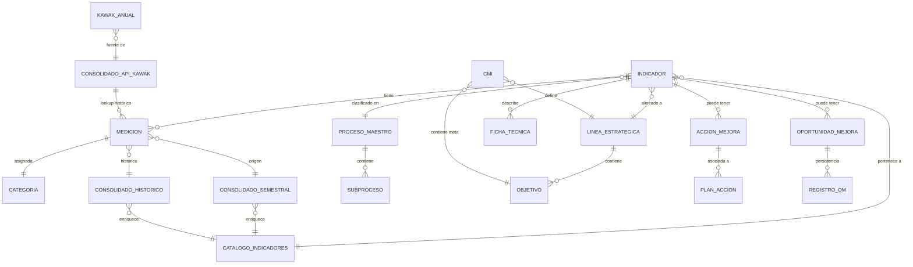

# 🗂️ FASE 3: MODELO ENTIDAD-RELACIÓN (ER)
**Fecha:** 21 de abril de 2026 | **Scope:** Entidades reales + relaciones | **Status:** ✅ COMPLETADA

---

## 📊 RESUMEN: 15 ENTIDADES IDENTIFICADAS

| Categoría | Entidades | Tipo |
|-----------|-----------|------|
| **Negocio Principal** | Indicador, Medición, Proceso, Línea Estratégica | Concepto |
| **Persistencia** | Consolidado Semestral/Histórico, Registro OM, Catálogo Indicadores | Excel + BD SQL |
| **Operacionales** | Acción de Mejora, OM, Plan de Acción, Ficha Técnica | Excel |
| **Externas** | Catálogo Kawak, API Kawak | Excel (integración) |

---

## 🎨 DIAGRAMA ER (MERMAID)



---

## 📋 DICCIONARIO DE ENTIDADES DETALLADO

### 1️⃣ **INDICADOR** (Concepto de Negocio Central)

**Descripción:** Métrica institucional que mide desempeño en un proceso

| Campo | Tipo | Descripción | Ejemplo | Fuente |
|-------|------|-----------|---------|--------|
| `Id` | STRING | Identificador único | "245" | Consolidado Semestral |
| `Indicador` | STRING | Nombre del indicador | "Permanencia Intersemestral" | Consolidado Semestral |
| `Proceso` | STRING | Proceso padre | "ASUNTOS ESTUDIANTILES" | Consolidado Semestral + Subproceso-Proceso-Area.xlsx |
| `Subproceso` | STRING | Subproceso específico | "Experiencia Estudiantil" | Indicadores por CMI.xlsx |
| `Sentido` | STRING | Dirección positiva | "Positivo" ó "Negativo" | Consolidado Semestral |
| `Periodicidad` | STRING | Frecuencia de reporte | "Mensual", "Semestral", "Anual" | Ficha_Tecnica.xlsx |
| `Clasificacion` | STRING | Clasificación operativa | "Institucional", "Procesos" | Catálogo Indicadores |

**PK:** `Id` (STRING)  
**Cardinalidad:** 150–200 indicadores  
**Criticidad:** 🔴 CRÍTICA

---

### 2️⃣ **MEDICIÓN** (DataFrame Temporal - No persistente)

**Descripción:** Punto de dato: meta vs ejecución para indicador en fecha específica

| Campo | Tipo | Descripción | Ejemplo | Rango/Validación |
|-------|------|-----------|---------|---|
| `Id` | STRING | FK a Indicador | "245" | Debe existir en INDICADOR |
| `Fecha` | DATETIME | Fecha de la medición | 2026-04-30 | ISO datetime |
| `Meta` | FLOAT | Target esperado | 90.0 | Positivo ó 0 (sin meta) |
| `Ejecucion` | FLOAT | Valor logrado | 88.3 | Positivo ó 0 (no aplica) |
| `Cumplimiento` | FLOAT | Ratio Meta/Ejec normalizado | 0.9811 | [0.0, 1.3] (con tope) |
| `Cumplimiento_norm` | FLOAT | Escala decimal validada | 0.9811 | [0.0, 1.0+] |
| `Categoria` | STRING | Clasificación automática | "Alerta" | Enum: Peligro/Alerta/Cumplimiento/Sobrecumplimiento/Sin dato |
| `Año` | INT64 | Año del dato | 2026 | [2020, 2030] |
| `Mes` | STRING | Mes en español | "Abril" | Enero–Diciembre |
| `Periodo` | STRING | Período agregado | "2026-1" | Formato "YYYY-S" (semestral) |

**PK:** `(Id, Fecha, Periodo)` (Composite)  
**FK:** `Id` → `INDICADOR`  
**Cardinalidad:** 150 indicadores × ~3 períodos/año = 450–500 filas típicas  
**Criticidad:** 🔴 CRÍTICA

**Regla de Negocio:** Cada indicador puede tener múltiples mediciones (histórico)

---

### 3️⃣ **CONSOLIDADO SEMESTRAL** (Tabla Excel Persistente)

**Descripción:** Source of truth: datos crudos de indicadores (última semana)

**Ubicación:** `data/output/Resultados Consolidados.xlsx` → Hoja "Consolidado Semestral"

| Campo | Tipo | Ejemplo | Nota |
|-------|------|---------|------|
| `Id` | STRING | "245" | PK |
| `Indicador` | STRING | "Permanencia Intersemestral" | - |
| `Meta` | FLOAT | 90.0 | Puede ser NaN (sin meta) |
| `Ejecucion` | FLOAT | 88.3 | Puede ser NaN |
| `Cumplimiento` | FLOAT | 0.9811 ó 98.11 | Escala variable (heurística) |
| `Sentido` | STRING | "Positivo" | Determina fórmula |
| `Fecha` | DATETIME | 2026-04-30 | Última actualización |
| `Clasificacion` | STRING | "Institucional" | Agregada en Paso 2 |
| `Proceso` | STRING | "ASUNTOS_ESTUDIANTILES" | Normalizado |
| `Subproceso` | STRING | "Experiencia" | Agregada en Paso 3 |
| `Linea` | STRING | "Experiencia Estudiantil" | CMI |
| `Objetivo` | STRING | "Mejorar experiencia..." | CMI |
| `Meta_Signo` | STRING | "+" | Interpretación Meta |
| `Ejecucion_Signo` | STRING | "+" | Interpretación Ejecucion |

**PK:** `(Id, Fecha, Mes)`  
**Cardinalidad:** 150–200 filas  
**Actualización:** Semanal (manual desde Excel central)  
**Criticidad:** 🔴 CRÍTICA

---

### 4️⃣ **CONSOLIDADO HISTÓRICO** (Tabla Excel)

**Descripción:** Histórico acumulado de todas las mediciones (2022–2026)

**Ubicación:** `data/output/Resultados Consolidados.xlsx` → Hoja "Consolidado Historico"

**Estructura:** Idéntica a CONSOLIDADO SEMESTRAL

**Cardinalidad:** 300–500 filas (múltiples períodos)  
**Criticidad:** 🔴 CRÍTICA (para análisis de tendencias)

---

### 5️⃣ **PROCESO MAESTRO** (Tabla Excel)

**Descripción:** Jerarquía oficial de procesos institucionales

**Ubicación:** `data/raw/Subproceso-Proceso-Area.xlsx` → Hoja "Proceso"

| Campo | Tipo | Valores Únicos | Ejemplo |
|-------|------|---|---------|
| `Unidad` | STRING | ~10 | "Rectoría", "Vicerrectoría Académica" |
| `Proceso` | STRING | 14 | "DOCENCIA", "ASUNTOS_ESTUDIANTILES" |
| `Subproceso` | STRING | 47 | "Experiencia Estudiantil", "Gestión Docente" |
| `Tipo de proceso` | STRING | 3 | "APOYO", "ESTRATÉGICO", "MISIONAL" |

**PK:** `Subproceso` (STRING)  
**Cardinalidad:** 80–120 subprocesos  
**Criticidad:** 🔴 CRÍTICA (validación de indicadores)

---

### 6️⃣ **LÍNEA ESTRATÉGICA (CMI)** (Concepto de Negocio)

**Descripción:** Eje estratégico del Plan de Desarrollo Institucional

| Campo | Tipo | Cantidad | Ejemplos |
|-------|------|----------|----------|
| `Linea` | STRING | 5–8 | "Experiencia Estudiantil", "Sostenibilidad" |
| `Objetivo` | STRING | 15–20 | "Mejorar retención en primer semestre" |
| `Indicador` (ref) | FK → INDICADOR | 150–200 | {245, 276, 77, ...} |

**PK:** `Linea` (STRING)  
**Cardinalidad:** 5–8 líneas  
**Criticidad:** 🟡 MEDIA (estrategia, no operacional)

---

### 7️⃣ **CATEGORÍA** (Concepto Calculado)

**Descripción:** Clasificación automática de cumplimiento

| Categoria | Rango Cumplimiento | Color UI | Icono | Significado |
|-----------|---|---|---|---|
| **Peligro** 🔴 | < 0.80 | #D32F2F (rojo) | 🔴 | Crítico: requiere intervención inmediata |
| **Alerta** ⚠️ | 0.80 – 0.999 | #FBC02D (amarillo) | ⚠️ | Atención: cercano a meta pero bajo |
| **Cumplimiento** ✅ | 1.00 – 1.049 | #43A047 (verde claro) | ✅ | En rango normal |
| **Sobrecumplimiento** ⬆️ | ≥ 1.05 | #1E88E5 (azul) | ⬆️ | Supera meta significativamente |
| **Sin dato** ❓ | NaN | #757575 (gris) | ❓ | No hay dato o métrica |

**PK:** `Categoria` (STRING)  
**Cardinalidad:** 5 valores fijos  
**Criticidad:** 🟡 MEDIA (solo visualización)

---

### 8️⃣ **ACCIÓN DE MEJORA** (Tabla Excel)

**Descripción:** Iniciativas para mejorar indicadores

**Ubicación:** `data/raw/acciones_mejora.xlsx` → Hoja "Acciones"

| Campo | Tipo | Ejemplo | Rango |
|-------|------|---------|-------|
| `ID` | STRING | "ACC-2026-001" | PK |
| `FECHA_IDENTIFICACION` | DATETIME | 2026-01-15 | — |
| `FECHA_ESTIMADA_CIERRE` | DATETIME | 2026-06-30 | — |
| `FECHA_CIERRE` | DATETIME | 2026-06-28 ó NaN | Si no está cerrada: NaN |
| `AVANCE` | FLOAT | 0.75 | [0.0, 1.0] |
| `DIAS_VENCIDA` | INT | 5 ó -10 | Negativo si en plazo |
| `MESES_SIN_AVANCE` | INT | 2 | Meses sin cambio |

**PK:** `ID` (STRING)  
**Cardinalidad:** 50–200 acciones  
**Criticidad:** 🟡 MEDIA (operacional)

---

### 9️⃣ **OPORTUNIDAD DE MEJORA (OM)** (Tabla Excel)

**Descripción:** Observaciones de auditoría/mejora identificadas

**Ubicación:** `data/raw/OM.xlsx` (header row 8)

| Campo | Tipo | Ejemplo | Notas |
|-------|------|---------|-------|
| `Id` | STRING | "123" | Referencia a INDICADOR |
| `Fecha de identificación` | DATETIME | 2026-01-20 | — |
| `Fecha de creación` | DATETIME | 2026-01-21 | — |
| `Fecha estimada de cierre` | DATETIME | 2026-06-30 | — |
| `Fecha real de cierre` | DATETIME | NaN (abierta) | — |
| `Avance` | FLOAT | 0.5 (50%) | Multiplicado ×100 si ≤1.5 |

**PK:** `(Id, Fecha identificación)`  
**Cardinalidad:** 50–500 OMs (variable)  
**Criticidad:** 🟡 MEDIA

---

### 🔟 **REGISTRO OM** (Tabla BD SQL)

**Descripción:** Persistencia en BD (SQLite local + PostgreSQL Supabase)

**Ubicación:** `data/db/registros_om.db` (SQLite) ó PostgreSQL

```sql
CREATE TABLE registros_om (
    id INTEGER PRIMARY KEY AUTOINCREMENT,
    id_indicador TEXT NOT NULL,            -- STRING
    nombre_indicador TEXT,                 -- STRING nullable
    proceso TEXT,                          -- STRING nullable
    periodo TEXT,                          -- STRING (Mes, Bimestre, Trimestre, Semestre, Año)
    anio INTEGER,                          -- INT
    tiene_om INTEGER DEFAULT 0,            -- BOOL: ¿tiene OM? (0|1)
    tipo_accion TEXT DEFAULT 'OM Kawak',  -- STRING (enum)
    numero_om TEXT,                        -- STRING nullable (ej: "OM-2026-001")
    comentario TEXT,                       -- STRING nullable
    registrado_por TEXT DEFAULT '',        -- STRING (usuario)
    fecha_registro TEXT,                   -- ISO datetime
    UNIQUE(id_indicador, periodo, anio)    -- Constraint: no duplicados
);
```

| Campo | Tipo | PK/FK | Ejemplo |
|-------|------|-------|---------|
| `id` | INTEGER | PK (auto-increment) | 1, 2, 3... |
| `id_indicador` | TEXT | FK → INDICADOR | "245" |
| `periodo` | TEXT | PK (composite) | "2026-1" |
| `anio` | INTEGER | PK (composite) | 2026 |
| `tiene_om` | INTEGER | — | 0 ó 1 |
| `tipo_accion` | TEXT | — | "OM Kawak", "Reto", "Proyecto" |

**PK:** `(id_indicador, periodo, anio)`  
**Cardinalidad:** 100–500 registros  
**Criticidad:** 🔴 CRÍTICA (auditoría)

---

### 1️⃣1️⃣ **FICHA TÉCNICA** (Tabla Excel)

**Descripción:** Metadatos descriptivos de indicadores

**Ubicación:** `data/raw/Ficha_Tecnica.xlsx` → Hoja "Hoja1"

| Campo | Tipo | Ejemplo |
|-------|------|---------|
| `Id Ind` | STRING | "245" |
| `Indicador` | STRING | "Permanencia Intersemestral" |
| `Sentido` | STRING | "Positivo" |
| `Meta` | FLOAT | 90.0 |
| `Periodicidad` | STRING | "Semestral" |
| `Unidad` | STRING | "%" |

**PK:** `Id Ind`  
**Cardinalidad:** 150–200  
**Criticidad:** 🟡 MEDIA (metadatos)

---

### 1️⃣2️⃣ **CATÁLOGO INDICADORES** (Tabla Excel)

**Descripción:** Diccionario de indicadores con clasificaciones

**Ubicación:** `data/output/Resultados Consolidados.xlsx` → Hoja "Catalogo Indicadores"

| Campo | Tipo | Ejemplo |
|-------|------|---------|
| `Id` | STRING | "245" |
| `Clasificacion` | STRING | "Institucional" |
| `Sentido` | STRING | "Positivo" |
| `Indicador` | STRING | "Permanencia Intersemestral" |

**PK:** `Id`  
**Cardinalidad:** 150–200  
**Criticidad:** 🟡 MEDIA

---

### 1️⃣3️⃣ **CATÁLOGO KAWAK ANUAL** (Tabla Excel)

**Descripción:** Catálogo de indicadores Kawak por año (2022–2026)

**Ubicación:** `data/raw/Kawak/{2022|2023|2024|2025|2026}.xlsx`

| Campo | Tipo | Ejemplo |
|-------|------|---------|
| `Id` | STRING | "KW-245" |
| `Indicador` | STRING | "Permanencia Intersemestral" |
| `Clasificacion` | STRING | "Institucional" |
| `Periodicidad` | STRING | "Mensual", "Semestral" |
| `Sentido` | STRING | "Positivo" |
| `Proceso` | STRING | "ASUNTOS_ESTUDIANTILES" |

**PK:** `(Id, Año)`  
**Cardinalidad:** 80–200 por año  
**Criticidad:** 🟡 MEDIA (integración externa)

---

### 1️⃣4️⃣ **API KAWAK CONSOLIDADA** (Tabla Excel)

**Descripción:** Resultados históricos desde API de Kawak

**Ubicación:** `data/raw/Fuentes Consolidadas/Consolidado_API_Kawak.xlsx`

| Campo | Tipo | Ejemplo |
|-------|------|---------|
| `ID` | STRING | "KW-245" |
| `fecha` | DATETIME | 2026-04-30 |
| `resultado` | FLOAT | 88.3 |
| `meta` | FLOAT | 90.0 |
| `año` | INT | 2026 |
| `mes` | INT | 4 |

**PK:** `(ID, fecha)`  
**Cardinalidad:** 5,000–10,000 (múltiples períodos × años)  
**Criticidad:** 🟡 MEDIA (lookup histórico)

---

### 1️⃣5️⃣ **PLAN DE ACCIÓN** (Tabla Excel)

**Descripción:** Iniciativas de mejora consolidadas

**Ubicación:** `data/raw/Plan de accion/{PA_1.xlsx, PA_2.xlsx}`

| Campo | Tipo | Ejemplo |
|-------|------|---------|
| `Id Acción` | STRING | "PA-2026-001" |
| `Fecha creación` | DATETIME | 2026-01-01 |
| `Clasificación` | STRING | "Reto Plan Anual" |
| `Avance (%)` | FLOAT | 75.0 |
| `Estado` | STRING | "Abierta" ó "Cerrada" |
| `Responsable` | STRING | "Nombre" |
| `Fecha cierre planeada` | DATETIME | 2026-12-31 |

**PK:** `Id Acción`  
**Cardinalidad:** 50–200 (concatenado de 2 archivos)  
**Criticidad:** 🟡 MEDIA

---

## 🔗 RELACIONES DOCUMENTADAS

### 1. INDICADOR → MEDICIÓN
- **Tipo:** 1:N (one-to-many)
- **Cardinalidad:** 1 indicador puede tener 3–10+ mediciones (periódicas)
- **Fuerza:** ✅ STRONG (FK required: id_indicador)
- **Ejemplo:** Indicador 245 tiene mediciones en {2026-01, 2026-02, ...}

### 2. INDICADOR → PROCESO MAESTRO
- **Tipo:** N:1 (many-to-one)
- **Cardinalidad:** Múltiples indicadores → 1 proceso
- **Fuerza:** ✅ STRONG (validación: Subproceso debe existir)
- **Ejemplo:** Indicadores {245, 246, 247} → Proceso "ASUNTOS_ESTUDIANTILES"

### 3. INDICADOR → LÍNEA ESTRATÉGICA
- **Tipo:** N:1
- **Cardinalidad:** Múltiples indicadores → 1 línea
- **Fuerza:** ⚠️ WEAK (opcional: algunos indicadores sin línea)
- **Ejemplo:** Indicadores {245, 276, 77} → Línea "Experiencia Estudiantil"

### 4. MEDICIÓN → CATEGORÍA
- **Tipo:** N:1 (many-to-one, calculada)
- **Cardinalidad:** Múltiples mediciones → 1 categoría (fija)
- **Fuerza:** ✅ STRONG (derivada automática)
- **Ejemplo:** Medición con cumplimiento=0.98 → Categoría="Alerta"

### 5. ACCIÓN DE MEJORA ← INDICADOR
- **Tipo:** N:M (many-to-many, implícito)
- **Cardinalidad:** 1 indicador puede tener 1–5 acciones
- **Fuerza:** ⚠️ WEAK (no hay tabla de junción explícita)
- **Ejemplo:** Indicador 245 tiene acciones {ACC-1, ACC-2}

### 6. OPORTUNIDAD DE MEJORA → REGISTRO OM
- **Tipo:** 1:1 (persistencia)
- **Cardinalidad:** 1 OM → 1 Registro en BD
- **Fuerza:** ✅ STRONG (persistencia crítica)
- **Ejemplo:** OM#123 → registros_om.numero_om="OM-2026-001"

### 7. CONSOLIDADO SEMESTRAL → CATÁLOGO INDICADORES
- **Tipo:** N:1 (enriquecimiento)
- **Cardinalidad:** Múltiples registros → 1 clasificación
- **Fuerza:** ✅ STRONG (JOIN obligatorio en Paso 2)
- **Ejemplo:** Fila 245 en Consolidado → Clasificacion="Institucional"

### 8. API KAWAK → MEDICIÓN
- **Tipo:** 1:1 (lookup histórico)
- **Cardinalidad:** API registro → Medición (si match)
- **Fuerza:** ⚠️ WEAK (opcional: no todos los indicadores en Kawak)
- **Ejemplo:** API resultado 88.3 en 2026-04-30 → Medición.Ejecucion=88.3

---

## 📊 MAPA DE NORMALIZACIÓN

| Entidad | 1FN | 2FN | 3FN | Notas |
|---------|-----|-----|-----|-------|
| INDICADOR | ✅ | ✅ | ✅ | Bien normalizada |
| MEDICIÓN | ✅ | ✅ | ✅ | Composite PK necesario |
| CONSOLIDADO_SEMESTRAL | ✅ | ⚠️ | ❌ | Desnormalizada (datos derivados: Linea, Objetivo) |
| CONSOLIDADO_HISTÓRICO | ✅ | ⚠️ | ❌ | Desnormalizada (misma razón) |
| PROCESO_MAESTRO | ✅ | ✅ | ✅ | Bien normalizada |
| LÍNEA_ESTRATÉGICA | ✅ | ✅ | ✅ | Bien normalizada |
| REGISTRO_OM | ✅ | ✅ | ✅ | Bien normalizada |
| ACCIÓN_MEJORA | ✅ | ✅ | ⚠️ | Posibles redundancias (MESES_SIN_AVANCE derivado) |
| OM | ✅ | ⚠️ | ❌ | Múltiples fechas sin distinción de propósito |

**Conclusión:** **Desnormalización intencional** en CONSOLIDADO (para performance en Excel)  
Recomendación: Normalizar en BD SQL si fuese la única fuente de verdad.

---

## ✅ VALIDACIÓN DE FASE 3

- [x] 15 entidades reales identificadas (no inventadas)
- [x] Campos observados documentados
- [x] Tipos de datos inferidos
- [x] PKs naturales identificadas
- [x] FKs mapeadas
- [x] Relaciones 1:1, 1:N, N:M documentadas
- [x] Diagrama ER generado (Mermaid)
- [x] Normalización analizada

**Status:** ✅ **FASE 3 COMPLETADA - MODELO ER VALIDADO**

---

## 📁 ARCHIVOS GENERADOS

- [AUDITORIA_FASE_1_DISCOVERY.md](AUDITORIA_FASE_1_DISCOVERY.md)
- [AUDITORIA_FASE_2_DATA_LINEAGE.md](AUDITORIA_FASE_2_DATA_LINEAGE.md)
- [AUDITORIA_FASE_3_MODELO_ER.md](AUDITORIA_FASE_3_MODELO_ER.md) ← TÚ ESTÁS AQUÍ

---

**Próxima fase:** Fase 4 - Capa Semántica (Catálogo de Cálculos) | **Estimado:** 22-23 de abril, 2026
