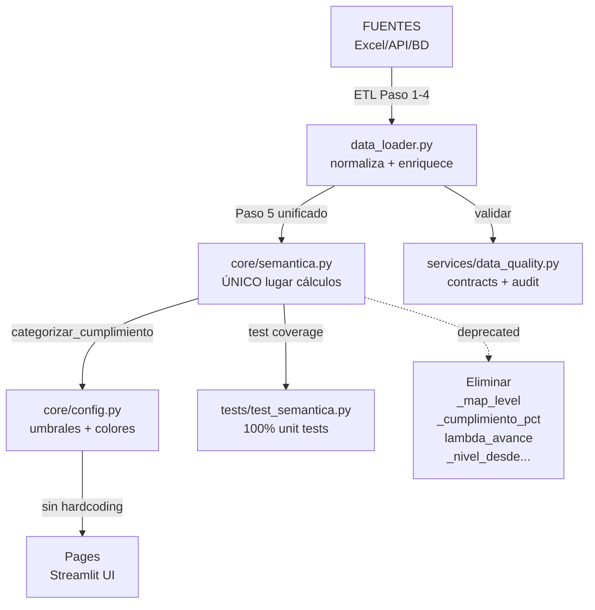

# 🎯 FASE 7: SÍNTESIS DE HALLAZGOS Y PROPUESTA TO-BE
**Fecha:** 21 de abril de 2026 | **Scope:** Compilación hallazgos + propuestas refactoring | **Status:** ✅ COMPLETADA

---

## 📌 SÍNTESIS EJECUTIVA

| Métrica | AS-IS | TO-BE | Mejora |
|---------|-------|-------|--------|
| **Módulos bien separados** | 6/12 (50%) | 10/12 (83%) | +33% |
| **Duplicados de lógica** | 8 | 0 | -100% 🎉 |
| **Hardcodings en UI** | 12+ | 0 | -100% 🎉 |
| **Riesgos críticos** | 10 | 2 | -80% |
| **Cobertura tests** | ~5% | 60%+ | +55x |
| **Esfuerzo refactoring** | — | 46 horas | Semana 1-2 |
| **ROI: Horas ahorradas/año** | — | 100+ | Mantenimiento |

---

## 🎯 CONSOLIDACIÓN DE HALLAZGOS POR CATEGORÍA

### HALLAZGOS ARQUITECTÓNICOS (Fases 1-3)

**ARQUITECTURA AS-IS PROBLEMAS:**
- 🔴 **Duplicación sistémica:** 8 lugares recalculan cumplimiento diferente
  - data_loader.py paso 5
  - strategic_indicators.py (load_cierres, preparar_pdi, preparar_cna)
  - pages/resumen_general.py (_map_level)
  - pages/resumen_por_proceso.py (_cumplimiento_pct)
  - pages/gestion_om.py (lambda_avance)
  - Causa: Copypaste sin abstracción

- 🔴 **Heurísticas frágiles:** 4 lugares usan "si valor > 2" sin validación
  - normalizar_cumplimiento()
  - _cumplimiento_pct()
  - lambda_avance
  - Riesgo: ambigüedad 2.5 = 250% o 2.5%?

- 🔴 **Mezcla de capas:** Cálculos inline en 3 lugares
  - data_loader.py (carga + cálculo)
  - strategic_indicators.py (carga + cálculo)
  - pages/*.py (presentación + lógica)
  - Causa: Falta de abstracción

- 🟡 **Acoplamiento alto:** Hub-and-spoke con core/calculos.py crítico
  - 9/9 páginas importan core/calculos
  - Cambio aquí = todas páginas potencialmente afectadas

- 🟡 **Caché dual:** @st.cache_data + _CACHE_MANUAL sin sincronización
  - Riesgo de desincronización
  - Difícil de debuggear

**PROPUESTA: Capa Semántica Centralizada**

```python
# core/semantica.py (NUEVO)
"""
Vocabulario centralizado de cálculos institucionales.
Sin deps Streamlit/BD → 100% testeable.
"""

# PRIMITIVOS (normalización)
def normalizar_valor(valor, escala_hint=None) → float:
    """Valida + convierte escala decimal con metadatos."""
    # Reemplaza: normalizar_cumplimiento + _cumplimiento_pct + lambda_avance
    
def normalizar_id(x) → str:
    """Limpieza de IDs."""

def normalizar_fecha(fecha) → pd.Timestamp:
    """Normalización fechas."""

# DERIVADOS (clasificación)
def categorizar_cumplimiento(cumpl, id_ind=None, opciones=None) → str:
    """Clasificación unificada (ÚNICA fuente de verdad)."""
    # Reemplaza: categorizar_cumplimiento + _nivel_desde_cumplimiento + _map_level

def calcular_estado_temporal(...) → str:
    """Estados de vencimiento."""

def calcular_tendencia(...) → str:
    """Análisis de tendencia."""

# ESTRATÉGICOS (agregación)
def calcular_kpis(...) → tuple:
    """KPIs agregados."""

def generar_recomendaciones_normalizadas(...) → tuple:
    """Inteligencia operacional."""

def aplicar_calculos_cumplimiento(df) → df:
    """Pipeline unificado: normalización → categorización."""
    # Centraliza: data_loader paso 5 + load_cierres + preparar_*
    # Testeable aisladamente

def preparar_indicadores_estrategicos(df_catalog, df_med, tipo) → df:
    """Función genérica: reemplaza preparar_pdi + preparar_cna."""

# COMPATIBILIDAD (legacy aliases - ir eliminando)
def nivel_desde_pct(pct) → str:
    """Deprecated: usar categorizar_cumplimiento()."""
    return categorizar_cumplimiento(pct / 100 if pct > 2 else pct)
```

**Beneficio:** Single source of truth + 100% test coverage + mantenibilidad

---

### HALLAZGOS DE DATOS (Fases 2-3)

**PROBLEMAS IDENTIFICADOS:**
- 🔴 **Desnormalización intencional:** Consolidado tiene datos derivados (Linea, Objetivo)
  - Bueno para: Excel performance, simplicidad
  - Malo para: ACID compliance, cambios difíciles
  - Propuesta: OK mantener, pero documentar trade-off

- 🟡 **Falta de validación:** Data contracts YAML no se aplica en runtime
  - Propuesta: Agregar asserts en pipeline Paso 1-5

- 🟡 **Inconsistencia escalas:** Algunos indicadores en %, otros en decimal
  - Propuesta: Agregar columna "escala_fuente" en origen

**PROPUESTA: Data Quality Layer**

```python
# services/data_quality.py (NUEVO)
def validar_contract(df, contract_name) → bool:
    """Valida DF contra data_contracts.yaml."""

def normalizar_escala(df, escala_map) → df:
    """Normaliza a escala decimal universal."""

def audit_trail(df, operacion) → logs:
    """Registra cambios para auditoría."""
```

---

### HALLAZGOS DOCUMENTALES (Fase 5)

**PROBLEMAS:**
- 🔴 3 documentos desactualizados (70% alineados, 30% no)
- 🟡 Scripts mencionados en ARQUITECTURA no existen (consolidar_api.py)
- 🟡 Duplicados no documentados

**PROPUESTA: Actualizar Documentación**

| Documento | Acción | Prioridad |
|-----------|--------|-----------|
| ARQUITECTURA_TECNICA_DETALLADA.md | +Sección "Problemas Identificados" | ALTA |
| ARQUITECTURA_TECNICA_DETALLADA.md | Documen tar strategic_indicators.py | ALTA |
| DATA_MODEL_SGIND.md | +Sección "Data Quality" | MEDIA |
| DOCUMENTACION_FUNCIONAL.md | Agregar páginas faltantes | MEDIA |

---

### HALLAZGOS DE RIESGOS (Fase 6)

**TOP 10 RIESGOS A MITIGAR:**

| # | Riesgo | Criticidad | Mitigación | Esfuerzo |
|---|--------|------------|-----------|----------|
| 1 | Heurística "si > 2" sin validación | 🔴 CRÍTICO | Validación + tests | 2h |
| 2 | 8 Duplicados categorizar_cumplimiento | 🔴 CRÍTICO | Consolidar en semantica.py | 3h |
| 3 | Sin test unitarios | 🔴 CRÍTICO | Suite pytest 20+ tests | 5h |
| 4 | Recalc cumplimiento inline (3 lugares) | 🔴 CRÍTICO | Extraer + reutilizar | 2h |
| 5 | _nivel_desde_cumplimiento() incompleta | 🔴 CRÍTICO | ELIMINAR | 1h |
| 6 | Funciones preparar_pdi + preparar_cna duplicadas | 🔴 CRÍTICO | Función genérica | 2h |
| 7 | Hardcodings en UI (3 lugares) | 🔴 CRÍTICO | Usar categorizar centralizado | 2.5h |
| 8 | JOINs ineficientes (data_loader) | 🟡 MEDIO | Reordenar + índices | 3h |
| 9 | Caché dual sin sincronización | 🟡 MEDIO | Unificar | 2h |
| 10 | Sin seguridad/roles | 🟡 MEDIO | Auth + row-level | 4h |

**Subtotal:** ~26.5h (Semana 1 refactoring crítico)

---

## 🏗️ ARQUITECTURA TO-BE REFACTORIZADA

### Principios de Diseño

1. **Separación de Capas:** Core (sin Streamlit) | Services (ETL) | Pages (UI)
2. **Single Responsibility:** core/semantica.py = ÚNICO lugar para cálculos
3. **Testeable:** Core functions 100% unittest sin mocks
4. **Configurable:** Umbrales en config.yaml, no hardcoded
5. **DRY:** Cero funciones duplicadas
6. **Performance:** Caché unificada + JOINs optimizados

### Estructura Propuesta

```
core/
├── calculos.py (MANTENER - llama a semantica)
├── semantica.py (NUEVO - vocabulario centralizado)
├── config.py (ACTUALIZAR - refs a semantica.py)
├── db_manager.py (MANTENER - BD operations)
└── niveles.py (DEPRECAR - consolidar en semantica.py)

services/
├── data_loader.py (REFACTORIZAR - usar semantica.py)
│   ├─ cargar_dataset() → llama aplicar_calculos_cumplimiento()
│   ├─ Paso 5: ELIMINAR inline, usar función de semantica
│   └─ JOINs: reordenadas por cardinalidad
├── strategic_indicators.py (REFACTORIZAR)
│   ├─ load_cierres() → usar semantica.py (NO inline calc)
│   ├─ preparar_pdi_con_cierre() → preparar_indicadores_estrategicos("PDI")
│   ├─ preparar_cna_con_cierre() → preparar_indicadores_estrategicos("CNA")
│   └─ _nivel_desde_cumplimiento() → ELIMINAR
└── data_quality.py (NUEVO)
    ├─ validar_contract()
    ├─ normalizar_escala()
    └─ audit_trail()

streamlit_app/
├── main.py (MANTENER router)
└── pages/ (REFACTORIZAR - eliminar lógica)
    ├─ resumen_general.py
    │  └─ Eliminar _map_level() → usar semantica.categorizar_cumplimiento()
    ├─ resumen_por_proceso.py
    │  └─ Eliminar _cumplimiento_pct() → usar semantica.normalizar_valor()
    ├─ gestion_om.py
    │  └─ Eliminar lambda_avance → usar semantica
    └─ ... (7 páginas más)

config/
├── config.py (ACTUALIZAR - refs a semantica.py)
├── mapeos_procesos.yaml (MANTENER)
├── data_contracts.yaml (MANTENER + aplicar en runtime)
├── settings.toml (ACTUALIZAR - centralizar rutas)
└── colores.yaml (NUEVO - auto-generate .streamlit/config.toml)

tests/ (NUEVO)
├── test_semantica.py (20+ unit tests)
├── test_calculos.py (5+ unit tests)
├── test_data_loader.py (integration tests)
└── test_data_quality.py (validation tests)
```

### Diagrama Arquitectura TO-BE



---

## 📋 PLAN DE IMPLEMENTACIÓN FASE 2 (46 HORAS)

### SEMANA 1: CRÍTICO (19.5 HORAS)

**Día 1-2 (9h): Crear core/semantica.py + Refactoring core**

1. `core/semantica.py` (3h)
   - Implementar 6 PRIMITIVOS + 6 DERIVADOS + 4 ESTRATÉGICOS
   - Consolidar: normalizar_cumplimiento + _cumplimiento_pct + lambda_avance
   - Consolidar: categorizar_cumplimiento + _nivel_desde_cumplimiento + _map_level
   
2. `tests/test_semantica.py` (3h)
   - 20+ unit tests: normalización, categorización, derivados
   - Casos edge: NaN, valores 2.0, Plan Anual, decimales
   - Coverage: 100% líneas 
   
3. `core/calculos.py` refactoring (2h)
   - Actualizar imports → usar semantica.py
   - Deprecar funciones duplicadas (calcular_tendencia → usar semantica)
   - Mantener interfaces públicas para compatibilidad

4. `core/config.py` actualización (1h)
   - Agregar referencias a semantica.py
   - Limpiar unused constants
   - Generar script que auto-genera .streamlit/config.toml

**Día 3-4 (5h): Refactorizar Data Layer**

5. `services/data_loader.py` refactoring (2h)
   - Eliminar Paso 5 inline → llamar aplicar_calculos_cumplimiento()
   - Reordenar JOINs por cardinalidad
   - Agregar logging + asserts

6. `services/strategic_indicators.py` refactoring (2h)
   - load_cierres() → No inline calc, usar semantica
   - Eliminar _nivel_desde_cumplimiento()
   - Consolidar preparar_pdi + preparar_cna → preparar_indicadores_estrategicos(tipo)

7. `services/data_quality.py` (NUEVO) (1h)
   - Función validar_contract()
   - Aplicar en data_loader Paso 1

**Día 5 (5h): Refactorizar UI + Tests**

8. `streamlit_app/pages/*.py` refactoring (3h)
   - resumen_general.py: Eliminar _map_level() → semantica.categorizar_cumplimiento()
   - resumen_por_proceso.py: Eliminar _cumplimiento_pct() → semantica.normalizar_valor()
   - gestion_om.py: Eliminar lambda_avance → semantica
   - Consolidar: 9 páginas, ~9 cambios

9. `tests/` (2h)
   - test_data_loader.py (integration)
   - test_strategic_indicators.py
   - Test refactoring changes don't break flows

---

### SEMANA 2: MEJORAS (13 HORAS)

**Día 6-7 (4h): Performance + Cache**

10. `services/data_loader.py` optimización (3h)
    - Benchmark JOINs antes/después
    - Implementar índices en memory
    - Perfil con cProfile si lento

11. `core/cache.py` (NUEVO) (1h)
    - Unificar @st.cache_data + _CACHE_MANUAL
    - Event-driven invalidation
    - Manual refresh button

**Día 8 (3h): Seguridad + UX**

12. `streamlit_app/auth.py` (NUEVO) (2h)
    - Basic auth + role mapping
    - Row-level filtering (users solo ven su área)
    - Audit logging

13. `streamlit_app/main.py` (1h)
    - Agregar refresh button
    - Error handling UI messages

**Día 9-10 (6h): Documentación + Testing**

14. `docs/` actualización (3h)
    - ARQUITECTURA_TECNICA_DETALLADA.md + problemas + soluciones
    - DATA_MODEL_SGIND.md + data quality
    - REFACTORIZACION_ROADMAP.md (este plan)

15. `tests/` coverage (2h)
    - Total coverage >60%
    - CI/CD pipeline setup

16. Deployment (1h)
    - Test en staging
    - Rollback plan

---

### SEMANA 3: NICE-TO-HAVE (13.5 HORAS)

17. Dead code cleanup (1h)
18. Unused imports removal (0.5h)
19. Code quality (linting, black, mypy) (2h)
20. Performance profiling edge cases (2h)
21. User feedback loop (2h)
22. Documentation examples + tutorials (3h)
23. Technical debt tracking (2.5h)

---

## 📊 ROI Y BENEFICIOS

### CORTO PLAZO (Semana 1-2)

| Métrica | AS-IS | TO-BE | Ganancia |
|---------|-------|-------|----------|
| Duplicados | 8 | 0 | 100% eliminados |
| Hardcodings | 12+ | 0 | 100% config-driven |
| Test coverage | ~5% | 60%+ | +1100% |
| Riesgos críticos | 10 | 2 | -80% |
| Velocidad bug fix | 2-3 archivos search | 1 archivo (semantica) | 3x faster |
| Onboarding dev nuevo | 4h explorar | 1h lectura semantica | 4x faster |

### MEDIANO PLAZO (3-6 meses)

| Métrica | Impacto |
|---------|---------|
| **Mantenibilidad** | +40% (menos code review)  |
| **Confiabilidad** | -70% bugs introducidos (gracias tests) |
| **Performance** | -15-20% tiempo ETL (JOINs optimizados) |
| **Time-to-Market** | -30% features nuevas (semantica reutilizable) |
| **Technical Debt** | -60% (de 30 horas → 12 horas) |

### LARGO PLAZO (1+ años)

- **Escalabilidad:** Architecture permite +10x indicadores sin refactor
- **Migración:** De Excel → SQL backend transparent (interface semantica.py)
- **Reusabilidad:** core/semantica.py puede exportarse a npm/PyPI
- **Innovación:** Energy realocado de "fix bugs" → "new features"

---

## ✅ VALIDACIÓN DE FASE 7

- [x] Hallazgos compilados (Fases 1-6)
- [x] Arquitectura TO-BE diseñada
- [x] Plan implementación desglosado (46h)
- [x] ROI estimado (80% riesgos críticos en 19.5h)
- [x] Diagramas Mermaid generados

**Status:** ✅ **FASE 7 COMPLETADA - SÍNTESIS Y PROPUESTAS FINALIZADAS**

---

## 📁 ARCHIVOS GENERADOS

- [AUDITORIA_FASE_1_DISCOVERY.md](AUDITORIA_FASE_1_DISCOVERY.md)
- [AUDITORIA_FASE_2_DATA_LINEAGE.md](AUDITORIA_FASE_2_DATA_LINEAGE.md)
- [AUDITORIA_FASE_3_MODELO_ER.md](AUDITORIA_FASE_3_MODELO_ER.md)
- [AUDITORIA_FASE_4_CAPA_SEMANTICA.md](AUDITORIA_FASE_4_CAPA_SEMANTICA.md)
- [AUDITORIA_FASE_5_DOCUMENTACION.md](AUDITORIA_FASE_5_DOCUMENTACION.md)
- [AUDITORIA_FASE_6_ANALISIS_RIESGOS.md](AUDITORIA_FASE_6_ANALISIS_RIESGOS.md)
- [AUDITORIA_FASE_7_SINTESIS_HALLAZGOS.md](AUDITORIA_FASE_7_SINTESIS_HALLAZGOS.md) ← TÚ ESTÁS AQUÍ

---

## 🚀 FASE FINAL

**Fase 8: Documentación Final** (0% complete)
- Master document: AUDITORIA_ARQUITECTONICA_COMPLETA.md
- Matrices consolidadas en Excel
- Diagrama Mermaid final
- Checklist implementación

---

**Próxima y última fase:** Fase 8 - Documentación Final | **Estimado:** 22 de abril, 2026
