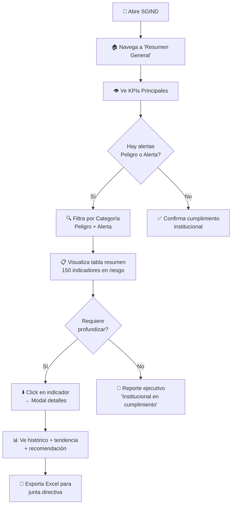
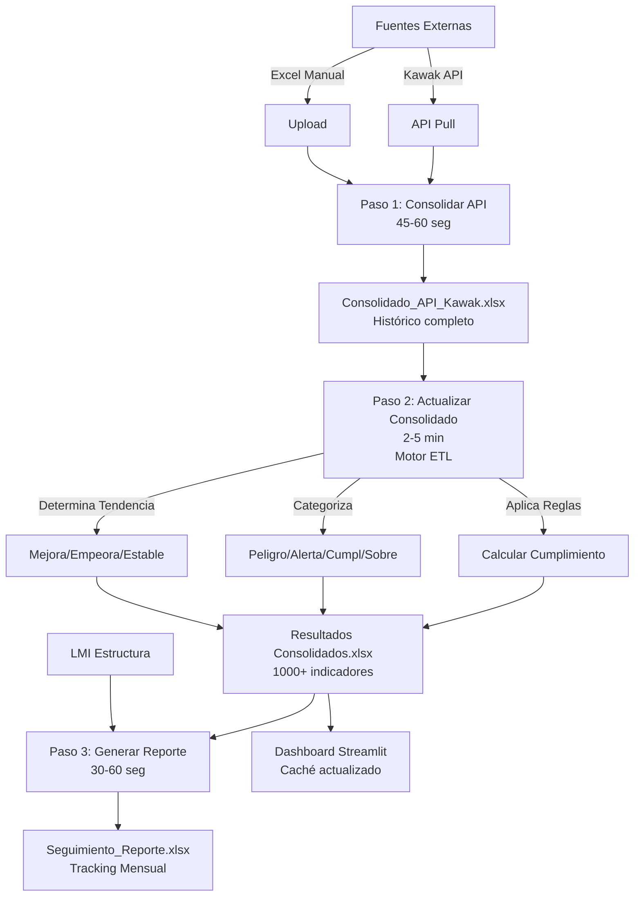

# Documentación Técnica y Funcional — SGIND

## Tabla de Contenidos

1. Entendimiento general
2. Lógica del modelo de datos
3. Fuentes de información
4. Inventario de artefactos
5. Documentación de cada visual
6. Evaluación UX/UI
7. Diagnóstico general
8. Propuesta de mejora (TO BE)

---

## 1. Entendimiento General

### Objetivo del Proyecto
El Sistema de Gestión Integral de Indicadores Institucionales (SGIND) es una plataforma centralizada para la consolidación, análisis, reporte y monitoreo de más de 1,000 indicadores de desempeño institucional del Politécnico Grancolombiano. Su propósito es automatizar la recolección de datos desde múltiples fuentes (APIs, Excel, bases de datos), calcular métricas clave, categorizar riesgos y facilitar la toma de decisiones mediante dashboards interactivos y reportería automática.

### Usuarios Objetivo
- **Directivos:** Seguimiento de KPIs estratégicos y alertas institucionales.
- **Líderes de Proceso:** Monitoreo y comparación de indicadores por área.
- **Equipo de Calidad:** Gestión de Oportunidades de Mejora (OM) y planes de acción.
- **Analistas de BI:** Exportación y análisis avanzado de datos.

### Casos de Uso Principales
- Consulta centralizada del estado de indicadores.
- Detección temprana de riesgos mediante semáforos y alertas.
- Generación automática de reportes y benchmarking.
- Registro y trazabilidad de acciones de mejora.
- Análisis histórico y drill-down por proceso, subproceso y área.

---

## 2. Lógica del Modelo de Datos

### Métricas Calculadas
- **Cumplimiento (%)**: $(\text{Ejecución} / \text{Meta}) \times 100$.
- **Tendencia**: Variación porcentual respecto a periodos anteriores.
- **Categorización de riesgo**: Clasificación automática en Peligro, Alerta, Cumplimiento, Sobrecumplimiento según umbrales definidos.
- **Alertas**: Detección de incumplimientos y generación de notificaciones.
- **Benchmarking**: Comparativas por proceso, área, sede y periodo.

### Dimensiones y Jerarquías
- **Jerarquía institucional**: Área → Proceso → Subproceso → Indicador.
- **Dimensiones adicionales**: Periodo (mes, año), Sede, Tipo de indicador, Estado de OM.

### Reglas de Negocio Implícitas
- Solo se consideran indicadores activos y validados.
- La hoja “Consolidado Semestral” es la fuente oficial para reportería.
- Los indicadores de Gestión OM usan “Consolidado Histórico”.
- Validaciones de integridad y consistencia mediante contratos de datos (data contracts YAML).

### Supuestos y Validaciones
- Todas las fuentes deben cumplir el esquema definido en config/data_contracts.yaml.
- El procesamiento es batch diario (no real-time).
- Los datos históricos se mantienen para análisis de tendencias y auditoría.

---

## 3. Fuentes de Información

### Origen de Datos
- **Excel**: Resultados Consolidados, API Kawak, Catálogo Kawak, Indicadores por CMI, Ficha Técnica, Acciones de mejora, OM histórica, Plan de acción, Jerarquía procesos, LMI reporte, Salidas no conformes.
- **Bases de datos**: SQLite local (registros OM), PostgreSQL/Supabase (registros OM remoto).
- **Archivos de configuración**: TOML y YAML para parámetros, contratos y mapeos.

### Tipo de Carga
- **Automática**: Scripts ETL consolidan y validan fuentes diariamente.
- **Manual**: Actualización de archivos Excel por responsables de área.
- **Sincronización**: Registros OM sincronizados entre SQLite local y PostgreSQL remoto.

### Frecuencia de Actualización
- **Diaria**: Consolidado de indicadores y reportería.
- **Eventual**: Actualización de catálogos, jerarquías y fichas técnicas.

### Problemas Potenciales de Calidad
- Inconsistencias entre fuentes (versiones, formatos).
- Errores de digitación en archivos Excel.
- Retrasos en la actualización manual de fuentes.
- Falta de validación previa a la carga (mitigado con data contracts).

---

## 4. Inventario de Artefactos

### Dashboards / Páginas Principales (Streamlit)
- **Resumen General:** Vista 360° de indicadores, semáforo de riesgos, drill-down institucional.
- **CMI Estratégico:** Seguimiento de indicadores alineados al Plan de Desarrollo Institucional.
- **Plan de Mejoramiento:** Registro y seguimiento de acciones de mejora.
- **Gestión OM:** Administración de Oportunidades de Mejora, vinculación con indicadores en riesgo.
- **Resumen por Proceso:** Análisis detallado por proceso/subproceso.
- **Tablero Operativo:** Control operativo, calidad de datos y trazabilidad.

### Visuales por Página
- Tablas dinámicas de indicadores.
- Semáforos de riesgo (colores).
- Gráficos de tendencia y benchmarking.
- Listados de acciones de mejora y OM.
- Filtros jerárquicos (área, proceso, subproceso, periodo).

### Tablas, Scripts y Modelos
- **Tablas Excel:** Resultados Consolidados, Indicadores por CMI, Acciones de mejora, OM histórica, Plan de acción.
- **Bases de datos:** registros_om.db (SQLite), public.registros_om (PostgreSQL/Supabase).
- **Scripts ETL:** actualizar_consolidado.py, generar_reporte.py, consolidar_indicadores_propuestos.py, diagnose_niveles_proceso.py.
- **Componentes Python:** core/calculos.py, core/db_manager.py, services/data_loader.py.

### Flujos ETL/ELT
- Consolidación diaria de fuentes Excel.
- Validación y transformación de datos.
- Cálculo de métricas y categorización de riesgos.
- Generación de artefactos para dashboards y reportería.

---

## 5. Documentación de Cada Visual

### 5.1 Resumen General (`resumen_general.py`)
- **Objetivo analítico:** Proveer una visión ejecutiva 360° del estado de los indicadores institucionales, con énfasis en riesgos y cumplimiento.
- **Métricas mostradas:** Cumplimiento promedio, total de indicadores, semáforo de riesgo (porcentaje en peligro/alerta/cumplimiento/sobrecumplimiento), tendencias históricas.
- **Dimensiones usadas:** Línea estratégica, objetivo, meta PDI, indicador, periodo.
- **Tipo de gráfico y justificación:** 
   - Tablas jerárquicas (drill-down) para navegación institucional.
   - Semáforo de colores para riesgos (intuitivo y rápido).
   - Gráficos de barras y líneas para tendencias.
- **Insight esperado:** Identificación rápida de áreas críticas y focos de mejora.
- **Riesgos de interpretación:** 
   - Sobreinterpretación de variaciones menores.
   - Falta de contexto sobre causas de bajo desempeño.

### 5.2 CMI Estratégico (`cmi_estrategico.py`)
- **Objetivo analítico:** Monitorear el avance de los indicadores alineados al Plan de Desarrollo Institucional (PDI).
- **Métricas mostradas:** Cumplimiento por línea, objetivo y meta PDI; total de indicadores; benchmarking entre líneas.
- **Dimensiones usadas:** Línea, objetivo, meta PDI, periodo.
- **Tipo de gráfico y justificación:** 
   - Barras apiladas y tablas para comparar líneas y metas.
   - Colores institucionales para reforzar la identidad visual.
- **Insight esperado:** Detección de líneas estratégicas rezagadas y oportunidades de mejora.
- **Riesgos de interpretación:** 
   - Comparaciones sin considerar diferencias de volumen entre líneas.
   - Posible sesgo por indicadores atípicos.

### 5.3 Gestión OM (`gestion_om.py`)
- **Objetivo analítico:** Gestionar y monitorear Oportunidades de Mejora (OM) asociadas a indicadores en riesgo.
- **Métricas mostradas:** Número de OM abiertas/cerradas, avance de planes de acción, cumplimiento de indicadores asociados.
- **Dimensiones usadas:** Indicador, periodo, estado OM, responsable.
- **Tipo de gráfico y justificación:** 
   - Tablas de seguimiento, gráficos de avance y semáforos de estado.
- **Insight esperado:** Seguimiento puntual de la efectividad de acciones correctivas.
- **Riesgos de interpretación:** 
   - Falta de actualización manual puede distorsionar el estado real.
   - Riesgo de duplicidad de OM si no hay control de unicidad.

### 5.4 Plan de Mejoramiento (`plan_mejoramiento.py`)
- **Objetivo analítico:** Monitorear el cumplimiento de indicadores CNA y la efectividad de acciones de mejora asociadas.
- **Métricas mostradas:** Cumplimiento por factor y característica CNA, número de acciones de mejora, avance de cierre.
- **Dimensiones usadas:** Año, factor, característica, indicador, periodo.
- **Tipo de gráfico y justificación:** 
   - Tablas filtrables por año/factor/característica.
   - Barras y gráficos de avance para visualizar cumplimiento y progreso.
- **Insight esperado:** Identificación de factores críticos y seguimiento puntual de acciones de mejora.
- **Riesgos de interpretación:** 
   - Filtros mal aplicados pueden ocultar problemas relevantes.
   - Avance reportado depende de la actualización manual de acciones.

### 5.5 Resumen por Proceso (`resumen_por_proceso.py`)
- **Objetivo analítico:** Analizar el desempeño de indicadores a nivel de proceso y subproceso.
- **Métricas mostradas:** Cumplimiento promedio, tendencia histórica, distribución de riesgos por proceso.
- **Dimensiones usadas:** Proceso, subproceso, indicador, periodo.
- **Tipo de gráfico y justificación:** 
   - Gráficos de barras y líneas para tendencias y comparativos.
   - Tablas detalladas para análisis granular.
- **Insight esperado:** Detección de procesos críticos y patrones de desempeño.
- **Riesgos de interpretación:** 
   - Comparaciones sin normalizar pueden inducir a error.
   - Falta de contexto sobre causas de bajo desempeño.

### 5.6 Tablero Operativo (`tablero_operativo.py`)
- **Objetivo analítico:** Proveer una visión operativa de los indicadores, calidad de datos y trazabilidad de acciones.
- **Métricas mostradas:** KPIs globales, distribución de indicadores por estado, alertas de frecuencia, calidad de datos (QC).
- **Dimensiones usadas:** Proceso, indicador, estado, periodicidad, fecha.
- **Tipo de gráfico y justificación:** 
   - Donut y barras para distribución de estados.
   - Kanban para seguimiento de acciones/OM.
   - Paneles de calidad de datos y trazabilidad.
- **Insight esperado:** Control operativo y detección de cuellos de botella o problemas de calidad.
- **Riesgos de interpretación:** 
   - Alertas pueden generar ruido si no se ajustan umbrales.
   - Panel de calidad depende de la correcta ingesta de artefactos.

---

## 6. Evaluación UX/UI

- **Uso de colores:** Paleta institucional y semáforos intuitivos (verde, amarillo, rojo, azul). Colores consistentes para líneas estratégicas y estados.
- **Jerarquía visual:** Títulos claros, paneles principales destacados, navegación jerárquica (drill-down), uso de pestañas y expanders para filtros.
- **Storytelling:** Flujo lógico desde visión general hasta detalle, permitiendo identificar focos críticos y navegar hasta la causa raíz.
- **Consistencia de estilos:** Tipografía, botones y tablas homogéneas. Gráficos y tablas alineados con la identidad visual institucional.
- **Problemas de legibilidad:** 
   - Tablas extensas pueden requerir scroll horizontal.
   - Algunos gráficos pueden saturarse si hay demasiados indicadores.
   - Filtros avanzados pueden no ser evidentes para usuarios nuevos.

---

## 7. Diagnóstico General

- **Qué está bien:**
   - Arquitectura modular y escalable.
   - Consolidación automática y validación de datos.
   - Reporterías y visuales alineados a necesidades institucionales.
   - Trazabilidad de acciones de mejora y OM.
- **Qué falta:**
   - Mayor automatización en la actualización de fuentes manuales.
   - Mejor documentación inline y tooltips en la interfaz.
   - Narrativa automática de insights clave.
   - Integración de analítica predictiva.
- **Qué sobra:**
   - Algunas tablas y filtros redundantes.
   - Visuales duplicados entre páginas.
- **Riesgos críticos:**
   - Dependencia de actualización manual de Excel.
   - Posibles inconsistencias entre fuentes.
   - Riesgo de interpretación errónea por falta de contexto en visuales complejos.

---

## 8. Propuesta de Mejora (TO BE)

- **Rediseño estructural:** Unificar filtros y navegación, simplificar visuales redundantes, mejorar onboarding de usuarios.
- **Nuevos visuales:** Incorporar gráficos de dispersión para análisis de correlaciones, mapas de calor para riesgos, y paneles de insights automáticos.
- **Automatización:** Integrar conectores directos a bases de datos y APIs, reducir carga manual, implementar validaciones automáticas previas a la carga.
- **Uso de IA:** 
   - Predicción de incumplimientos y generación de alertas proactivas.
   - Detección automática de anomalías en tendencias.
   - Narrativa automática de insights clave en cada dashboard.
   - Sugerencias de acciones de mejora basadas en patrones históricos.

### CU-1: Directivo Consulta Status Institucional

**Actor:** Vicerrector, Director de Área  
**Frecuencia:** Diaria / Semanal  
**Objetivo:** Obtener snapshot de salud institucional

#### Flujo Normal:



#### Resultado Esperado:

```
SGIND Dashboard Abierto - 07:30 AM

┌─────────────────────────────────────────────┐
│         KPIs INSTITUCIONALES                │
├─────────────────────────────────────────────┤
│ Total de Indicadores      │ 1,000          │
│ 🔴 En Peligro (< 80%)     │  50 (5.0%)     │
│ 🟡 En Alerta (80-99%)     │ 150 (15.0%)    │
│ 🟢 Cumplimiento (100-104%)│ 700 (70.0%)    │
│ 🔵 Sobrecumplimiento (≥105%)|100 (10.0%)   │
├─────────────────────────────────────────────┤
│ Tasa de Cumplimiento: 80.0%                │
│ Meses consecutivos en riesgo (máx): 3      │
└─────────────────────────────────────────────┘

[FILTROS]
Año: 2026 ⏱️ Mes: Marzo 📅 Proceso: [Todos ▼]

[TABLA - Consolidado del Período]
ID   │ Indicador              │ Proceso         │ Cumpl. │ Estado  │ Tendencia
─────┼────────────────────────┼─────────────────┼────────┼─────────┼──────────
150  │ Tasa Aprobación        │ ACADÉMICA       │  95%   │ 🟢 Cumpl│    ↑
151  │ Permanencia            │ ACADÉMICA       │  78%   │ 🔴 Pelig│    ↓
152  │ Egreso Oportuno        │ ACADÉMICA       │  88%   │ 🟡 Alerta│    →
...
```

---

### CU-2: Líder de Proceso Gestiona Indicadores de su Área

**Actor:** Directora Académica, Coordinador de Calidad  
**Frecuencia:** Quincenal / Mensual  
**Objetivo:** Asegurar cumplimiento de indicadores asignados a su proceso

#### Flujo Normal:

```
1️⃣ REVISAR STATUS
   └─ Abre SGIND
   └─ Filtra: Proceso = "DOCENCIA"
   └─ Ve: 25 indicadores de su proceso
      ├─ 2 en Peligro 🔴
      ├─ 5 en Alerta 🟡
      └─ 18 en Cumplimiento ✅

2️⃣ ANALIZAR INCUMPLIMIENTOS
   └─ Click en indicador "Tasa Aprobación" (En Peligro)
   └─ Abre modal "Detalles Indicador"
   
   ┌─────────────────────────────────────┐
   │ INDICADOR: Tasa Aprobación          │
   ├─────────────────────────────────────┤
   │ ID: 150                              │
   │ Meta: 90%                            │
   │ Ejecución: 71%                       │
   │ Cumplimiento: 0.79 (79%) 🔴 PELIGRO │
   │                                      │
   │ Tendencia: ↓ EMPEORANDO (mejora)    │
   │ Meses en peligro: 3 consecutivos     │
   │                                      │
   │ Recomendación:                       │
   │ "Deterioro crítico. Ejecutar plan    │
   │  de acción INMEDIATO. Revisar diseño │
   │  de evaluación y tutorías."          │
   │                                      │
   │ [Histórico] [Crear OM] [Exportar]   │
   └─────────────────────────────────────┘

3️⃣ CREAR OPORTUNIDAD DE MEJORA
   └─ Click "Crear OM"
   
   ┌─────────────────────────────────────┐
   │ REGISTRO DE OPORTUNIDAD DE MEJORA   │
   ├─────────────────────────────────────┤
   │ ID Indicador: 150                    │
   │ (Auto) Número OM: OM-2026-035        │
   │                                      │
   │ Descripción:                         │
   │ "Revisión formato evaluación parcial,│
   │  capacitación docentes, tutorías"    │
   │                                      │
   │ Plazo: [15/05/2026]                 │
   │ Responsable: [Dra. María López ▼]   │
   │                                      │
   │ [Crear OM] [Cancelar]               │
   └─────────────────────────────────────┘

4️⃣ SEGUIMIENTO POSTERIOR
   └─ Cada semana:
      ├─ Verifica status OM en "Plan Mejoramiento"
      ├─ Actualiza descripción con avances
      └─ Al cumplir acciones: cambia estado a "Cerrada"
      
   └─ Al siguiente período (Abril 2026):
      ├─ Revisa resultado: "Tasa Aprobación 82%" ✅
      └─ Cierra OM exitosa
```

---

### CU-3: Analista Monitorea Tendencias y Riesgos

**Actor:** Analista de BI, Especialista de Calidad  
**Frecuencia:** Continuo  
**Objetivo:** Identificar patrones, alertas tempranas, recomendaciones

#### Flujo Normal:

```
1️⃣ EXPLORACIÓN POR CATEGORÍA
   └─ Abre "Resumen General"
   └─ TAB: "Histórico" (gráficos)
   
   📈 Gráficos disponibles:
   ├─ Línea temporal: Cumplimiento último año
   │  └─ Identifica: Indicadores en mejora vs deterioro
   │
   ├─ Scatter "Riesgo": Meta vs Ejecución
   │  └─ Identifica: Indicadores cercanos a incumplimiento
   │
   ├─ Heatmap "Semáforo": Período × Estado
   │  └─ Identifica: Patrones estacionales de riesgo
   │     (Ej: Enero siempre en peligro → problema sistémico)
   │
   └─ Distribución: ¿Cuántos en cada categoría?
      └─ Identifica: Trending up/down de riesgo global

2️⃣ ANÁLISIS POR PROCESO
   └─ Navega a "Resumen por Proceso"
   └─ Selecciona: PROCESO = "INVESTIGACIÓN"
   
   Heatmap Subproceso × Período:
   ┌───┬──────┬──────┬──────┬──────┬──────┐
   │Sub│ Ene  │ Feb  │ Mar  │ Abr  │ May  │
   ├───┼──────┼──────┼──────┼──────┼──────┤
   │Inv│ 🔴   │ 🔴   │ 🟡   │ 🟢   │ 🟢   │
   │Org│ 🟢   │ 🟢   │ 🟢   │ 🟢   │ 🟢   │
   │Ext│ 🟡   │ 🟡   │ 🟡   │ 🟡   │ 🟡   │
   └───┴──────┴──────┴──────┴──────┴──────┘
   
   Insight:
   └─ "Investigación mejorando (EM→OK en 3 meses)"
   └─ "Extensión crónica en alerta → requiere plan largo plazo"

3️⃣ DETECCIÓN DE ANOMALÍAS
   └─ Filtra: "Indicadores con cambio > 20% último mes"
   
   Anomalías detectadas:
   ID 280: Satisfacción Estudiantes
           └─ Bajó de 92% → 65% (Cto -27%)
           └─ Alerta: ¿Cambio en metodología? ¿Evento crítico?
           └─ Recomendación: Investigar causa raíz URGENTE

4️⃣ REPORTERÍA PARA JUNTA
   └─ Exporta Excel con:
      ├─ Resumen últimas 2 semanas
      ├─ Indicadores en Peligro (50) con recomendaciones
      ├─ OMs creadas vs cerradas (trending)
      └─ Forecast: "Proyectado 80 indicadores en riesgo para junio"
```

---

### CU-4: Equipo de Calidad Administra OMs

**Actor:** Especialista de Aseguramiento de Calidad  
**Frecuencia:** Continuo (actualización semanal)  
**Objetivo:** Garantizar cierre de OMs en plazo

#### Flujo Normal:

```
SEMANA 1: Crear OMs por incumplimientos nuevos
├─ Abre "Plan Mejoramiento"
├─ Ve nuevas OMs creadas automáticamente por directivos
├─ Revisa descripciones y ajusta si es necesario
├─ Asigna responsables
└─ Establece plazo realista (15-30 días típico)

┌─────────────────────────────────────────────────┐
│ TABLA: Oportunidades de Mejora Abiertas (7 nuevas)│
├─────────────────────────────────────────────────┤
│ OM-2026-032 │ ID 150  │ Tasa Aprobación   │ Abiert│ 15/05
│ OM-2026-033 │ ID 210  │ Permanencia       │ Abiert│ 20/05
│ OM-2026-034 │ ID 305  │ Satisfacción      │ Abiert│ 10/05
│ ...         │        │                   │       │
└─────────────────────────────────────────────────┘

SEMANA 2-3: Seguimiento de ejecutores
├─ Envía recordatorios a responsables
│  "OM-2026-032 vence 15/05. Plazo en 1 semana."
├─ Recibe actualizaciones de avance:
│  └─ "Capacitada 30% de docentes. Avance en plan"
├─ Actualiza estado en SGIND:
│  └─ Abre OM, edita descripción con avances
│  └─ Cambia estado: "Abierta" → "En Ejecución"
└─ Documenta.evidencias en adjuntos (opcional)

SEMANA 4: Cierre de OMs ejecutadas
├─ Para OM-2026-032 (Tasa Aprobación):
│  ├─ Verifica: "Tasa Aprobación actual = 82%" ✅
│  ├─ Valida: "Meta era 90%, mejora 3 puntos es éxito"
│  └─ Cierra OM: Estado = "Cerrada" + fecha cierre
│
├─ Para OM-2026-034 (Satisfacción):
│  ├─ Verifica: Aún en 68% ❌
│  ├─ Verifica plazo: Vencida hace 3 días⚠️
│  ├─ Reclasifica: "Retrasada" + "Reasignar responsable"
│  └─ Extiende plazo: +15 días
│
└─ Reporte quincenal:
   ├─ OMs cerradas exitosas: 5/7
   ├─ OMs retrasadas: 2/7
   ├─ Tasa de cierre: 71%
   └─ Tendencia: ↑ mejorando

MENSUAL: Consolidar resultados
├─ Extrae métrica: "OMs creadas / OMs cerradas" = 0.5
│  └─ Insight: "Lentitud en ejecución, requiere incentivo"
├─ Por proceso: ¿Cuál cierra rápido? ¿Cuál rezaga?
└─ Reporte a Rectoría: "XX OMs cerradas, YY en proceso"
```

---

## Procesos Clave del Sistema

### Proceso 1: Consolidación Diaria de Datos

**¿Cuándo?** Automático cada día 06:00 AM UTC  
**¿Quién?** Sistema (scheduler/cron)  
**¿Duración?** 3-7 minutos  
**¿Salida?** 2 archivos Excel + QA report



**Detalles:**

#### Paso 1: Consolidar API (45-60 seg)

Objetivo: Fusionar todos los datos históricos en una fuente única

Input:
- `data/raw/Kawak/Catalogo_2022.xlsx` ... `Catalogo_2026.xlsx` (catálogos anuales)
- `data/raw/API/Resultados_2022.xlsx` ... `Resultados_2026.xlsx` (históricos)

Operaciones:
1. **Limpieza de IDs**
   - Eliminar espacios: "ID 150" → "ID150"
   - Eliminar caracteres especiales: "ID-150" → "ID150"
   - Aplicar mapeos especiales (Plan Anual: umbral 95% en lugar de 100%)

2. **Normalización de texto**
   - Codificar HTML: "&quot;" → '"', "&amp;" → "&"
   - Capitalización: normalizar mayúsculas/minúsculas
   - Fechas: formato consistente YYYY-MM-DD

3. **Concatenación de períodos**
   - Unir 5 años de datos en una tabla única
   - Preservar metadatos (fecha carga, usuario, fuente)
   - Ordenar por ID + fecha ascendente

Output:
- **Indicadores_Kawak.xlsx** (maestro de IDs activos con metadatos)
- **Consolidado_API_Kawak.xlsx** (archivo histórico completo)

---

#### Paso 2: Actualizar Consolidado (2-5 min) — Motor ETL Principal

Objetivo: Aplicar reglas de negocio y generar indicadores finales

Input:
- `Consolidado_API_Kawak.xlsx` (del Paso 1)
- `config/settings.toml` (año cierre, validaciones)
- Catálogos auxiliares (CMI, LMI, mapeos procesos, áreas)

Reglas aplicadas:
```
┌─ NORMALIZACIÓN
│  └─ Si Cumplimiento > 2 → Dividir por 100
│     Ej: 150 → 1.50 (150%)
│
├─ DETECCIÓN N/A
│  └─ Si análisis contiene "no aplica" → Categoría = Sin Dato
│
├─ VALIDACIÓN
│  └─ Si Meta ≤ 0 → ERROR (parar procesamiento)
│  └─ Si Ejecución < 0 → ERROR
│  └─ Si Fecha no válida → ERROR
│
├─ DEDUPLICACIÓN
│  └─ LLAVE única: (ID, período, año, sede)
│  └─ Si duplicados → Utilizar registro con flag "Revisar"=1
│     De lo contrario → Más reciente por fecha carga
│
├─ CATEGORIZACIÓN
│  └─ Estándar:
│     - < 0.80 → Peligro 🔴
│     - 0.80 - 0.99 → Alerta 🟡
│     - 1.00 - 1.04 → Cumplimiento 🟢
│     - ≥ 1.05 → Sobrecumplimiento 🔵
│
│  └─ Plan Anual (IDs: 373, 390, 414-420, 469-471):
│     - < 0.95 → Peligro 🔴
│     - 0.95 - 0.99 → Alerta 🟡
│     - ≥ 1.00 → Cumplimiento 🟢 (tope 100%)
│
│  └─ Tope 100 (IDs: 208, 218):
│     - Nunca sobrecumple (capped a 1.00)
│
├─ TENDENCIA
│  └─ Compara: Último período vs anterior
│  └─ Si mejora > 2% → Tendencia = ↑
│  └─ Si empeora > 2% → Tendencia = ↓
│  └─ De lo contrario → Tendencia = → (estable)
│
├─ RECOMENDACIONES
│  └─ Peligro + ↓ → "Deterioro crítico. Plan de acción inmediato."
│  └─ Peligro + → → "Criticidad mantenida. Revisar causa."
│  └─ Alerta → "A punto de incumplir. Intensificar esfuerzos."
│  └─ Cumplimiento + ↑ → "En buen camino. Mantener iniciativas."
│  └─ Sobrecumplimiento → "Excelente. Documentar y replicar."
│
└─ ENRIQUECIMIENTO
   ├─ Agregar: Nombre indicador, proceso, subproceso, área
   ├─ Agregar: CMI perspectiva si aplica
   └─ Agregar: Fórmula matemática y unidades
```

Construcción de 3 hojas:

1. **"Consolidado Histórico"** (10,000+ registros)
   - Todos los registros período a período
   - Columnas: ID, Nombre, Proceso, Período, Cumpl, Categoría, Tendencia, Recom

2. **"Consolidado Semestral"** (2,000+ registros) — Agregado
   - Grupo: (ID, Año, Semestre)
   - Cumplimiento = PROMEDIO del semestre
   - Categoría = MODA (más frecuente)
   - Meses en peligro = COUNT

3. **"Consolidado Cierres"** (500+ registros) — Cierre Anual
   - Grupo: (ID, Año)
   - Último registro del año (cierre formal)
   - Variación vs año anterior

Output:
- **Resultados Consolidados.xlsx** (20 MB, 3 hojas, 10,000+ registros)

---

#### Paso 3: Generar Reporte (30-60 seg)

Objetivo: Crear tracking de qué fue reportado vs pendiente

Input:
- `lmi_reporte.xlsx` (estructura LMI, cuáles indicadores existen)
- `Consolidado_API_Kawak.xlsx` (qué se reportó este período)

Lógica:
```
Para cada indicador en LMI:
  ├─ ¿Existe registro en Consolidado_API_Kawak para período actual?
  │  └─ Sí → "Reportado" ✅
  │  └─ No → "Pendiente" ⏳
  │
  ├─ ¿El indicador está marcado como "no aplica" en análisis?
  │  └─ Sí → "No Aplica" ⚪
  │  └─ No → (seguir lógica anterior)
  │
  └─ Guardar estado en tabla
```

Output:
- **Seguimiento_Reporte.xlsx** (4 hojas)
  1. "Tracking Mensual" — Matriz Id × mes (Reportado/Pendiente/N/A)
  2. "Seguimiento" — Copia enriquecida de LMI
  3. "Resumen" — Estadísticas (50 reportados, 40 pendientes, 10 N/A)
  4. Hojas por periodicidad (mensuales, semestrales)

---

### Proceso 2: Monitoreo Diario en Dashboard

**¿Cuándo?** Continuo, cuando usuario abre página  
**¿Quién?** Directivos, líderes de proceso  
**¿Duración?** 1-2 segundos (caché)

```
Usuario abre streamlit_app/main.py
  ↓
Selecciona "📊 Resumen General"
  ↓
Sistema verifica caché:
  ├─ Si existe + TTL < 300s → Usar caché (instantáneo)
  ├─ Si expiró → Leer Excel (1-2 seg)
  └─ Si no existe → Mostrar "Ejecutar pipeline primero"
  ↓
Página renderiza 3 tabs:

TAB 1: "Consolidado"
├─ Filtros dinámicos (Año, Mes, Proceso, Categoría)
├─ Tabla con colores semáforo
├─ KPIs en dashboard
└─ Click en fila → Modal detalles
    └─ Histórico de indicador (gráfico líneal)
    └─ Meses en peligro
    └─ Recomendación + opción crear OM

TAB 2: "Histórico"
├─ Gráfico líneal: Cumplimiento últimos 12 meses
├─ Scatter: Meta vs Ejecución (detección outliers)
├─ Heatmap: Período × Estado (patrones)
└─ Distribución: ¿Cuántos en cada categoría?

TAB 3: "Cierres"
├─ Tabla: Cierre anual por indicador
├─ Columna: Variación vs año anterior (%)
└─ Ordenable por variación (detección cambios)
```

---

### Proceso 3: Creación y Cierre de OMs

**¿Cuándo?** Ad-hoc (cuando hay incumplimiento)  
**¿Quién?** Directivos crean, especialistas cierran  
**¿Duración?** 15-30 días (ejecución), pocos minutos (registro)

```
DETECCIÓN DE INCUMPLIMIENTO
  └─ Dashboard muestra: ID 150, Cumpl 78%, 🔴 Peligro
  
CREACIÓN DE OM
  └─ Click "Crear OM"
  └─ Modal abre:
     ├─ ID Indicador: 150 (precompletado)
     ├─ Número OM: OM-2026-035 (auto-generado)
     ├─ Descripción: [Textarea] "Mejorar tasa aprobación"
     ├─ Plazo: [Date picking] 15/05/2026
     ├─ Responsable: [Dropdown] "Dra. María López"
     └─ [Crear] botón
     
  └─ Click "Crear"
     └─ Sistema:
        ├─ Inserta en BD (registros_om.db)
        ├─ Genera número único
        ├─ Asigna estado = "Abierta"
        └─ Fecha creación = NOW()

SEGUIMIENTO SEMANAL
  └─ Especialista revisa "Plan Mejoramiento"
  └─ Tabla muestra: OM-2026-035, status "Abierta", Plazo 15/05
  └─ Click en OM → Editar
     ├─ Actualiza descripción con avance
     ├─ Cambia estado → "En Ejecución"
     └─ Guarda
     
CIERRE EXITOSA (cuando indicador se recupera)
  └─ Nueva lectura: Tasa Aprobación = 82% ✅
  └─ Especialista abre OM → Editar
     ├─ Valida: "Meta era 90%, mejora a 82% es positivo"
     ├─ Cambia estado → "Cerrada"
     ├─ Asigna fecha_cierre = TODAY()
     └─ Agrega comentario: "Ejecutadas 3 jornadas de capacitación"
     
CIERRE RETRASADA (si no se cumplió plazo)
  └─ Hoy: 16/05/2026, OM vence hoy pero Tasa aún = 79% ❌
  └─ Sistema alerta: "OM retrasada"
  └─ Especialista puede:
     ├─ Cambiar estado → "Retrasada" + fecha_vencimiento_actual
     ├─ Extender plazo: +15 días más
     ├─ Reasignar responsable
     └─ Solicitar autorización para cerrar sin meta (si contexto cambió)

MÉTRICAS POSTERIORES
  └─ Tasa de cierre: OMs cerradas / OMs creadas
  └─ Velocidad: Días promedio de ejecución
  └─ Efectividad: % de indicadores que mejoraron post-OM
  └─ Por responsable: Quién cierra más rápido
```

---

## Conceptos de Negocio

### Indicadores y Cumplimiento

**Indicador:** Medida cuantificable del desempeño de un proceso

```
ESTRUCTURA:
Indicador = Nombre + Formula + Meta + Unidad
Ej: "Tasa de Aprobación" = (Aprobados / Inscritos × 100) = 90% = Porcentaje

FÓRMULA CUMPLIMIENTO:
Cumplimiento = Ejecución / Meta

EJEMPLOS:
Indicador         Meta    Ejec    Cumpl   %
──────────────────────────────────────────
Tasa Apro         90      85      0.944   94.4% → Alerta 🟡
Egr Oportuno      80      80      1.00    100%  → Cumpl 🟢
Satisfacción      85      93      1.094   109%  → Sobre 🔵
Deserción         15      23      0.652   65.2% → Peligro 🔴
  (Meta baja = mejor)

INDICADORES ESPECIALES:
- Plan Anual (IDs: 373, 390...): Cumple desde 95% (no 100%)
- Negativo (Ej: Deserción): Meta / Ejecución (inversión)
- Tope 100 (IDs: 208, 218): No permite sobrecumplimiento
```

### Semáforo de Riesgo

```
CATEGORIZZACIÓNES:

🔴 PELIGRO
─────────
Rango: Cumplimiento < 80%
Significado: Indicador muy por debajo del objetivo
Urgencia: INMEDIATA
Acción: Plan de mejora emergente
Ejemplo: Tasa aprobación 70% (meta 90%)

Recursos necesarios:
  ├─ Revisión causa raíz THIS WEEK
  ├─ Implementación de acciones correctivas
  ├─ Monitoreo diario
  └─ Escalamiento a directiva

🟡 ALERTA
──────────
Rango: 80% ≤ Cumplimiento < 100%
Significado: Indicador por debajo del objetivo pero recuperable
Urgencia: ALTA
Acción: Plan de mejora coordinada
Ejemplo: Tasa aprobación 88% (meta 90%)

Recursos necesarios:
  ├─ Análisis de brechas (por qué no llegó a 100%)
  ├─ Actividades de apoyo (tutorías, fortalecimiento)
  ├─ Micromonitoreo (semanal)
  └─ Reportes de avance

🟢 CUMPLIMIENTO
────────────────
Rango: 100% ≤ Cumplimiento < 105%
Significado: Indicador en o muy cerca del objetivo
Urgencia: NORMAL
Acción: Mantener iniciativas actuales
Ejemplo: Tasa aprobación 92% (meta 90%)

Recursos necesarios:
  ├─ Mantener disponibilidad de recursos
  ├─ Evaluación periódica de sostenibilidad
  ├─ Identificar mejores prácticas para documentar
  └─ Monitoreo mensual estándar

🔵 SOBRECUMPLIMIENTO
──────────────────────
Rango: Cumplimiento ≥ 105%
Significado: Indicador SUPERANDO objetivo significativamente
Urgencia: NONE (pero documentar)
Acción: Replicación de buenas prácticas
Ejemplo: Tasa aprobación 96% (meta 90%)

Recursos necesarios:
  ├─ Documentar qué causó el éxito
  ├─ Identificar factores replicables en otras áreas
  ├─ Considerar elevar meta para próximo período
  ├─ Comunicar & reconocer esfuerzo equipo
  └─ Monitoreo mensual estándar

⚪ SIN DATO
───────────
Significado: No hay información disponible / No aplica
Razones:
  ├─ Período aún no reportado
  ├─ Indicador "no aplica" en este semestre
  ├─ Metodología cambió → recalcular
  ├─ Error en carga de datos
  
Acción: Contactar responsable, solicitar dato o validación
```

### Tendencias

```
↑ MEJORA (Cumplimiento aumentó vs período anterior)
  Cambio: > 2%
  Interpretación: Indicador evolucionando positivamente
  Ejemplo: Mar: 78% → Abr: 82% ✅

↓ EMPEORA (Cumplimiento disminuyó vs período anterior)
  Cambio: < -2%
  Interpretación: Indicador deteriorándose, acción urgente
  Ejemplo: Mar: 92% → Abr: 88% ⚠️

→ ESTABLE (Cumplimiento sin cambio significativo)
  Cambio: -2% a +2%
  Interpretación: Status quo mantenido, situación sin cambio
  Ejemplo: Mar: 85% → Abr: 86% (estable)

NOTA: Tendencia de 3+ períodos en peligro = ALARMA ROJA
      Sistema indica: "Meses en peligro: 3" cuando ocurre
```

### Oportunidades de Mejora (OM)

```
DEFINICIÓN:
Acción correctiva / mejora vinculada a un indicador
en incumplimiento durante un período específico

CARACTERÍSTICAS:
  ├─ Vínculo: 1 OM ← N indicadores (pero tracking por período)
  ├─ Estado: Abierta → En Ejecución → Cerrada | Retrasada
  ├─ Plazo: Típicamente 15-30 días
  ├─ Responsable: Asignado a líder de proceso
  └─ Registro: En BD, visible en "Plan Mejoramiento"

CICLO DE VIDA:
┌─────────────────────────────────────────────────┐
│ 1. APERTURA (Cuando indicador incumple)         │
│    └─ Estado: Abierta                           │
│    └─ Descripción: Acciones propuestas          │
│    └─ Plazo: 15-30 días adelante                │
│                                                 │
│ 2. SEGUIMIENTO (Semanal)                         │
│    └─ Estado: En Ejecución                      │
│    └─ Actualizar descripción con avances        │
│    └─ Refrendar plazo si es necesario           │
│                                                 │
│ 3. CIERRE (Cuando mejora el indicador)          │
│    └─ Estado: Cerrada + fecha actual            │
│    └─ Comentario: Resultado vs meta             │
│    └─ ¿Sostenible? → Monitoreo próximos meses  │
│                                                 │
│ 4. RETRASADA (Si vence sin cerrar)              │
│    └─ Estado: Retrasada + nueva fecha           │
│    └─ Análisis: ¿Por qué se retrasó?           │
│    └─ Reasignar responsable si es necesario     │
└─────────────────────────────────────────────────┘

MATRIZ DE DECISIÓN:
Indicador mejora 1 período → Cierre OM
Indicador mejora 2+ períodos → Sostenibilidad confirmada
Indicador empeora post-OM → Raíz más profunda, nueva OM

MÉTRICAS:
├─ Tasa de Cierre = OMs cerradas exitosas / OMs creadas
├─ Velocidad = Días promedio de ejecución
├─ Efectividad = % indicadores que mejoraron post-OM
└─ Por responsable = Quién cierra más rápido
```

---

## Guías por Rol

### 👔 Para Directivos

#### Caso de Uso: "Reporte Ejecutivo para Junta Directiva"

**Objetivo:** Presentar status institucional en 5 minutos

**Pasos:**

1. Abre SGIND → "Resumen General"
2. Captura pantalla de KPIs principales
3. Filtra "Peligro" → Exporta tabla de 50 indicadores en riesgo
4. Crea narrativa:
   ```
   "SGIND Dashboard - Marzo 2026
   
   STATUS GENERAL: 80% cumplimiento
   ✅ 700 indicadores en cumplimiento
   ⚠️ 200 en riesgo (peligro + alerta)
   
   TOP 3 INCUMPLIMIENTOS:
   1️⃣ Tasa Aprobación: 78% (meta 90%)
      Acción: OM creada, capacitación en progreso
   2️⃣ Permanencia: 75% (meta 85%)
      Acción: OM creada, tutorías aumentadas
   3️⃣ Satisfacción: 82% (meta 90%)
      Acción: OM pendiente de crear, análisis en curso
   
   TENDENCIA: →
   Estable en últimas 3 semanas, en línea con planes"
   ```

5. Enriquece con gráfico de tendencia (Plotly)
6. Envía Excel con detalles

---

### 📊 Para Líderes de Proceso

#### Caso de Uso: "Seguimiento Semanal de Mis Indicadores"

**Objetivo:** Asegurar cumplimiento de su proceso

**Pasos:**

1. Abre SGIND → "Resumen General"
2. Filtra: `Proceso = "ACADEMIA"` → Ve 25 indicadores
3. Clasifica por categoría:
   ```
   🔴 Peligro (2): Tasa Apro, Deserción
   🟡 Alerta (5): Satisfacción, Egreso, ...
   🟢 Cumpl (18): ...
   ```
4. Para cada "Peligro":
   - Click en indicador → Lee recomendación
   - Si OM no existe → Create OM con responsable
   - Si OM existente → Revisa en "Plan Mejoramiento"
5. Reporta a equipo:
   ```
   "Semana: 11-17 Abril
   
   ✅ Avances:
     - Tasa Aprobación mejorando (78% → 80%)
     - Jornada capacitación completada (30 docentes)
   
   ⚠️ Riesgos:
     - Deserción aún en 18% (meta 15%)
     - Satisfacción estancada en 82% (meta 90%)
   
   📋 Acciones próxima semana:
     - Segunda jornada capacitación
     - Análisis detallado deserción
     - Revisión formato evaluación"
   ```

---

### 📈 Para Analistas de BI

#### Caso de Uso: "Análisis de Anomalías Mensual"

**Objetivo:** Identificar patrones, outliers, mejoras oportunidades

**Pasos:**

1. Abre SGIND → "Resumen General" → TAB "Histórico"
2. Analiza 4 gráficos:
   
   **Gráfico 1: Tendencia Líneal (últimos 12 meses)**
   - Identifica: ¿Indicadores mejorando? ¿Deteriorando?
   - Busca: Patrones estacionales (ej: enero siempre peligro)
   - Nota: Si línea sube → acción está funcionando
   
   **Gráfico 2: Scatter (Meta vs Ejecución)**
   - Identifica: Indicadores "cercanos a incumplimiento"
   - Busca: Agrupamientos (ej: Investigación siempre bajo)
   - Nota: Puntos por debajo diagonal = incumplimiento
   
   **Gráfico 3: Heatmap Semáforo**
   - Identifica: Patrones entre períodos
   - Busca: Columnas rojas = problemas crónicos
   - Nota: "Marzo siempre en riesgo" → investigar causa
   
   **Gráfico 4: Distribución (Pie/Donut)**
   - Identifica: Variación en proporción de categorías
   - Busca: Trending improvement vs deterioration
   - Nota: Si % rojo aumenta → alert a Rectoría

3. Crea reporte:
   ```
   ANÁLISIS ANOMALÍAS - MARZO 2026
   
   DETECCIONES:
   
   1. Mejoramiento Sostenido (↑)
      - 150 indicadores mejorando ÚLTIMAS 6 SEMANAS
      - Promedio mejora: 4.2%
      - Procesos líderes: Académica (+5%), Bienestar (+6%)
      
   2. Deterioro Crítico (↓)
      - ID 210 Permanencia: 92% → 75% en 1 mes (-17%)
      - ID 280 Satisfacción: 88% → 65% en 1 mes (-23%)
      - Causa probable: ???
      - RECOMENDACIÓN: Investigación causa raíz URGENTE
      
   3. Problemas Crónicos (>3 meses en riesgo)
      - ID 151 Eficiencia Administrativa: SIEMPRE 78%
      - ID 305 Cobertura Extensión: SIEMPRE 82%
      - Conclusión: Problemas sistémicos, no coyunturales
      - Recomendación: Redesign de procesos, no parches
      
   ACCIONES RECOMENDADAS:
   ├─ Investigar IDs 210, 280 (cambios > 20%)
   ├─ Replicar éxitos de Académica en otras áreas
   ├─ Replantear problemas crónicos (no OMs corta plazo)
   └─ Briefing ejecutivo para cambios metodológicos
   ```

4. Exporta datos al equipo de quality/mejora continua

---

### 🔧 Para Especialistas de Calidad

#### Caso de Uso: "Administración de OMs Semanal"

**Objetivo:** Garantizar cierre en plazo

**Pasos:**

1. Abre SGIND → "Plan Mejoramiento"
2. Ve tabla:
   ```
   OM        | ID  | Indicador      | Estado      | Plazo   | Días
   ──────────┼─────┼────────────────┼─────────────┼─────────┼──────
   OM-2026-32| 150 | Tasa Aprobación| En Ejecución| 15/05   | 3
   OM-2026-33| 210 | Permanencia    | Abierta     | 20/05   | 8
   OM-2026-34| 280 | Satisfacción   | Retrasada   | 10/05   | -6 ⚠️
   OM-2026-35| 305 | Cobertura      | Cerrada ✅  | 25/04   | -
   ```

3. Acciones:
   
   **Para "En Ejecución" (OM-2026-32)**
   - Envía recordatorio: "3 días para plazo"
   - Solicita actualización de avance
   - Prepara checklist de cierre (qué validar)
   
   **Para "Abierta" (OM-2026-33)**
   - Verifica descripción es clara
   - Valida responsable tiene capacidad
   - Fija checkpoint semanal
   
   **Para "Retrasada" (OM-2026-34)**
   - ⚠️ ALERTA: Vencida hace 6 días
   - Contacta responsable: ¿Qué pasó?
   - Opciones:
     ├─ Extender plazo +15 días (si realista)
     ├─ Reasignar responsable (si falla de personaOCO)
     ├─ Cerrar sin meta + análisis (si contexto cambió)
     └─ Criar nueva OM (si problema más profundo)
   
   **Para "Cerrada" (OM-2026-35)**
   - Valida: "Indicador mejoró como esperado"
   - Documenta: Qué funcionó, qué no
   - Archiva para lecciones aprendidas

4. Consolidado semanal:
   ```
   REPORTE OMs - SEMANA 11-17 ABRIL
   
   ESTADO ACTUAL:
   ├─ Abiertas: 10
   ├─ En Ejecución: 15
   ├─ Cerradas: 5 ✅
   └─ Retrasadas: 2 ⚠️
   
   CIERRES EXITOSOS (5):
   ├─ OM-2026-25: Tasa Apro, plazo original cumplido
   ├─ OM-2026-28: Satisfacción, plazo original cumplido
   └─ ...
   
   RETRASADAS (2):
   ├─ OM-2026-34: Saturación responsable, extendida
   ├─ OM-2026-36: Cambio metodológico, re-evaluando
   
   MÉTRICAS:
   ├─ Tasa de Cierre: 5/25 = 20%
   ├─ Días promedio: 18 días
   ├─ Tendencia: ↑ mejorando (semana anterior 10%)
   ```

---

## Preguntas Frecuentes

### General

**P: ¿Qué diferencia hay entre "Consolidado" y "Histórico" en el dashboard?**

R: 
- **Consolidado:** Datos actuales del período (THIS week/month)
- **Histórico:** Líneas de tendencia / períodos anteriores

**P: ¿Si cambio el filtro de Año, qué pasa con el caché?**

R: El caché se mantiene (5 minutos de validez). Si llevan >5 min sin refresh, Streamlit releerá el Excel automáticamente en el próximo tab change.

**P: ¿Puedo exportar datos para análisis? ¿Qué formato?**

R: Sí, Excel + Pivot tables. Click botón "Exportar" en cualquier tabla. Incluye estilos y colores.

---

### Indicadores

**P: ¿Por qué el indicador "Plan Anual" cumple desde 95% y no 100%?**

R: Porque es un indicador anual con meta consolidada. Una ejecución al 95% de la meta anual es aceptable (margen de variación estacional).

**P: ¿Un indicador puede ser "Sin Dato" permanentemente?**

R: No. Si ha sido sin dato 3+ meses, requiere revisión. Podría ser:
- Indicador no aplica en este año ← Retirar del tablero
- Cambio de metodología ← Re-calibrar meta
- Retraso cronológico en reporte ← Acelerar reporte

---

### Oportunidades de Mejora

**P: ¿Cuál es la diferencia entre OM "Retrasada" y "Cerrada"?**

R:
- **En Ejecución:** Plazo no vencido, acciones en curso
- **Cerrada:** Indicador mejoró, plazo respetado ✅
- **Retrasada:** Plazo vencido, indicador aún no mejoró ⚠️

**P: ¿Puedo cerrar una OM si el indicador NO mejoró?**

R: Generalmente NO. Excepciones:
- Contexto cambió (metodología nueva, retirar indicador)
- Causa raíz fue correctamente identificada pero requiere reforma mayor
- En estos casos: Crear NUEVA OM (no cerrar la actual)

**P: ¿Cuánto tiempo típico para cerrar una OM?**

R: 15-30 días, dependiendo:
- Simple (capacitación, proceso): 15-20 días
- Moderada (cambio de proceso): 20-30 días
- Compleja (reforma curricular): >30 días

---

### Dashboard y Reportería

**P: ¿Los datos del dashboard coinciden con "Resultados Consolidados.xlsx"?**

R: SÍ, el dashboard lee directamente del Excel. Diferencias raras (<1%):
- Caché de Streamlit desincronizado
→ Solución: Esperar 5 minutos o F5 Refresh

**P: ¿Puedo hacer drill-down desde un gráfico?**

R: Depende:
- Tablas Plotly: Sí, hover + click para detalles
- Gráficos Plotly: Parcial, hover muestra nombre indicador
- Recomendación: Usar TAB "Consolidado" para filtros precision

**P: ¿Qué colores usa SGIND para semáforo?**

R:
- 🔴 Rojo = Peligro (#D32F2F)
- 🟡 Naranja = Alerta (#FBAF17)
- 🟢 Verde = Cumplimiento (#43A047)
- 🔵 Azul oscuro = Sobrecumplimiento (#1A3A5C)
- ⚪ Gris = Sin Dato (#CCCCCC)

---

### Técnicas

**P: ¿Cómo funciona la deduplicación de indicadores?**

R: Si 2+ registros existen para missma (ID, período, año, sede):
1. Priorizar: ¿Existe uno con flag "Revisar"=1? → Usar ese
2. Si no: Usar más reciente por fecha_carga
3. Resultado: Un único registro por LLAVE

**P: ¿Qué hago si sospecho error en cumplimiento de un indicador?**

R:
1. Abre indicador en dashboard
2. Click "... Más opciones" → "Marcar para revisión"
3. Flag "Revisar"=1 en BD
4. Equipo técnico revisa en próxima consolidación
5. Notificación cuando corregido

**P: ¿Cuántos indicadores pueden tener múltiples OMs abiertas?**

R: Ilimitado en teoría. Recomendación:
- 1 OM por período típicamente
- Si misma causa raíz: 1 OM + N acciones
- Si causas distintas: N OMs (pero evaluar scope)

---

### Soporte y Errores

**P: "Error: Consolidado_API_Kawak.xlsx not found"**

R: Pipeline no ejecutado hoy. Ejecuta:
```bash
python scripts/consolidar_api.py
```

**P: Dashboard muestra "0 registros"**

R: 
1. Verificar: ¿Pipeline ejecutado?
2. Verificar: ¿Filtros son muy restrictivos?
3. Verificar: ¿Año seleccionado tiene datos?
4. Solución: Cambiar filtro año → "2026" o "Todos"

**P: "Error: columna 'cumplimiento' no existe"**

R: Fallo en Paso 2 del pipeline. Ejecuta:
```bash
python scripts/actualizar_consolidado.py --verbose
```
Revisar `artifacts/pipeline_run_*.log`

**P: ¿A quién reporto un bug?**

R: GitHub Issues o email a: biinstitucional@poli.edu.co
Incluir:
- Fecha/hora del error
- Página donde ocurrió
- Captura de pantalla
- Filtros aplicados (si aplica)

---

## Anexos

### A. Glosario de Términos

**Cumplimiento:** Ejecución / Meta (en escala decimal, ej: 0.95 = 95%)

**Indicador:** Medida cuantificable del desempeño institucional

**Oportunidad de Mejora (OM):** Acción correctiva vinculada a indicador en incumplimiento

**Período:** Unidad de tiempo (mes, semestre, año)

**Semáforo:** Sistema de colores (Peligro/Alerta/Cumpl/Sobre)

**Tendencia:** Dirección de cambio (mejora ↑ / empeora ↓ / estable →)

**Meta:** Objetivo cuantitativo para indicador

**Ejecución:** Resultado actual / valor conseguido

---

### B. Matriz de Responsabilidades

| Responsabilidad | Directivo | Líder Proc | Analista | Especialista |
|-----------------|-----------|-----------|----------|--------------|
| Ver dashboard | ✅ | ✅ | ✅ | ✅ |
| Crear OM | ✅ | ✅ | - | ✅ |
| Cerrar OM | - | ✅ | - | ✅ |
| Análisis anomalías | - | ✅ | ✅ | - |
| Reportería ejecutiva | ✅ | - | ✅ | - |
| Admón BD | - | - | - | ✅ |

---

## 9. Configuración Centralizada

### Ubicación de Configuración

Desde **Fase 4 refactorización**, todas las funciones de UI importan directamente de `core.semantica`:

```python
# resumen_general.py
from core.semantica import normalizar_y_categorizar, obtener_icono_categoria

# resumen_por_proceso.py
from core.semantica import normalizar_valor_a_porcentaje, categorizar_cumplimiento

# gestion_om.py
from core.semantica import categorizar_cumplimiento, obtener_color_categoria
```

### Cambiar Umbrales

**Antes:** Actualizar en 8 lugares
```
❌ core/calculos.py
❌ core/semantica.py
❌ services/strategic_indicators.py
❌ streamlit_app/pages/resumen_general.py
❌ streamlit_app/pages/resumen_por_proceso.py
❌ streamlit_app/pages/gestion_om.py
(+ 2 más)
```

**Ahora:** Actualizar en 1 lugar
```python
# core/config.py
UMBRAL_PELIGRO = 0.80
UMBRAL_ALERTA = 1.00
UMBRAL_SOBRECUMPLIMIENTO = 1.05

# Plan Anual (especiales)
UMBRAL_ALERTA_PA = 0.95
UMBRAL_SOBRECUMPLIMIENTO_PA = 1.00  # Tope máximo

# ✅ Propaga automáticamente a toda la aplicación
```

### Indicadores Plan Anual

**Detección dinámica:**
```python
# core/config.py - Se carga del Excel
IDS_PLAN_ANUAL = load_plan_anual_ids_from_excel()
# Retorna: {373, 390, 414, 415, 416, 417, 418, 420, 469, 470, 471, ...}

# Uso en categorización
if id_indicador in IDS_PLAN_ANUAL:
    # Aplicar umbrales PA (0.95/1.00)
else:
    # Aplicar umbrales regulares (0.80/1.00/1.05)
```

---

**Última actualización:** 21 de abril de 2026  
**Próxima revisión:** 15 de mayo de 2026  
**Contacto:** biinstitucional@poli.edu.co
