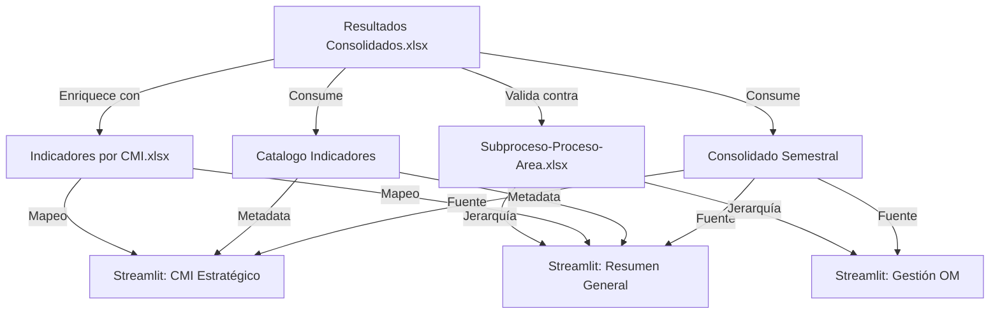

# 📋 Data Contracts para SGIND

**Documento:** DATA-CONTRACTS.md  
**Versión:** 1.0  
**Fecha:** 21 de abril de 2026  
**Propósito:** Definir esquemas, tipos de datos, y reglas de validación para todas las fuentes de datos SGIND  
**Audiencia:** Desarrolladores, Analistas de Datos, Especialistas QA

---

## Tabla de Contenidos

1. [Introducción](#introducción)
2. [Convenciones](#convenciones)
3. [Fuentes de Datos](#fuentes-de-datos)
4. [Esquemas de Tabla](#esquemas-de-tabla)
5. [Reglas de Validación](#reglas-de-validación)
6. [Matriz de Dependencias](#matriz-de-dependencias)

---

## Introducción

### Propósito

Data Contracts definen el **contrato entre productores y consumidores de datos**:

- **Productor:** Script/proceso que genera/actualiza datos
- **Consumidor:** Aplicación/reporte que consume datos
- **Contrato:** Esquema + tipos + validaciones garantizadas

### Beneficios

| Beneficio | Impacto |
|-----------|---------|
| **Claridad** | Toda la organización sabe qué esperar |
| **Confiabilidad** | Datos validados antes de consumo |
| **Debugging** | Errores señalados en origen, no en destino |
| **Versionamiento** | Cambios de esquema son explícitos |
| **Automatización** | Validación automática en pipelines |

### Responsabilidades

| Rol | Responsabilidad |
|-----|-----------------|
| **Data Engineer** | Mantener data contracts actualizado |
| **QA** | Validar contracts en tests |
| **Analytics** | Reportar infracciones encontradas |
| **DevOps** | Ejecutar validaciones en pipelines |

---

## Convenciones

### Tipos de Datos

```
string       → Texto (0-200 caracteres por defecto)
integer      → Número entero (i.e., 2026)
float        → Número decimal (i.e., 0.95)
boolean      → true / false
datetime     → Marca de tiempo ISO 8601 (YYYY-MM-DD HH:MM:SS)
categorical  → Valores de lista enumerada
```

### Atributos de Campo

```
tipo             → Tipo de dato (obligatorio)
requerida        → true/false (default: false)
longitud_min     → Mínimo caracteres (solo string)
longitud_max     → Máximo caracteres (solo string)
min              → Valor mínimo (solo numeric)
max              → Valor máximo (solo numeric)
patron           → Regex pattern (i.e., ^[0-9]+$)
valores_permitidos → Lista de opciones válidas (categorical)
formato          → Formato específico (i.e., YYYY-MM-DD)
descripcion      → Explicación en lenguaje natural (obligatorio)
```

### Cardinality Symbols

```
1:1  → Uno a uno
1:N  → Uno a muchos
N:M  → Muchos a muchos
0..1 → Opcional
1..* → Requerida al menos 1
```

---

## Fuentes de Datos

### 1. Resultados Consolidados (Fuente Principal)

**Archivo:** `data/output/Resultados Consolidados.xlsx`  
**Tipo:** Excel (múltiples hojas)  
**Actualizado por:** `scripts/actualizar_consolidado.py`  
**Frecuencia:** Manual (cuando hay nuevos datos de API)  
**Consumidores:** Todas las páginas Streamlit, reportes ejecutivos  
**SLA de Freshness:** 24 horas máximo desde última actualización en API

---

## Esquemas de Tabla

### TABLA: `Consolidado Semestral`

**Descripción:** Consolidación principal para consumo general de la aplicación. Fuente de verdad para todas las vistas de dashboard.

**Ubicación:** `data/output/Resultados Consolidados.xlsx` → Hoja: "Consolidado Semestral"  
**Registros esperados:** 1,000–2,000 por semestre  
**Cardinalidad:** Múltiples registros por Indicador (uno por período)

| Campo | Tipo | Req | Validación | Ejemplo | Descripción |
|-------|------|-----|------------|---------|------------|
| **Anio** | integer | ✅ | 2022–2030 | 2026 | Año del dato |
| **Fecha** | datetime | ✅ | ISO 8601 | 2026-04-30 | Fecha de corte |
| **Mes** | string | ✅ | [Enero–Diciembre] | Abril | Nombre mes en español |
| **Periodo** | string | ✅ | Regex: `^[0-9]{4}-[12]$` | 2026-1 | Semestre AAAA-S |
| **Id** | string | ✅ | Regex: `^[0-9a-zA-Z\-]+$` | 245 | ID único indicador |
| **Indicador** | string | ✅ | 5–200 chars | Permanencia Intersemestral | Nombre indicador |
| **Proceso** | string | ✅ | Debe existir en Maestro | ASUNTOS ESTUDIANTILES | Proceso padre |
| **Periodicidad** | categorical | ✅ | {Mensual, Trimestral, Semestral, Anual, Bimestral} | Semestral | Frecuencia medición |
| **Meta** | float | ❌ | ≥ 0 | 85.5 | Meta del período |
| **Ejecucion** | float | ❌ | ≥ 0 (o NaN) | 78.3 | Valor ejecutado |
| **Cumplimiento** | float | ❌ | 0–2.0 (o NaN) | 0.92 | Porcentaje cumplimiento |
| **Sentido** | categorical | ✅ | {Positivo, Negativo} | Positivo | Dirección positiva |
| **Tipo_Registro** | categorical | ❌ | {Metrica, No Aplica, null} | null | Marcador especial |

**Validaciones:**
- ✅ Fecha y Año deben ser coherentes (fecha.year == Anio)
- ✅ Periodo debe corresponder al corte temporal (Fecha.quarter mapping)
- ✅ Cumplimiento puede ser NaN aunque Meta o Ejecucion sean NaN
- ❌ No puede haber Id duplicado en mismo Periodo (si no es Metrica)
- ✅ Si Sentido=Negativo, Cumplimiento=Meta/Ejecucion else Ejecucion/Meta

**Ejemplos de Registros Válidos:**
```
ID: 245, Indicador: "Permanencia Intersemestral", Sentido: Positivo
  Meta: 85, Ejecucion: 78, Cumplimiento: 0.92 (92%)
  ✅ Válido

ID: 373, Indicador: "PDI - Eje 1", Sentido: Positivo, Plan Anual
  Meta: 100, Ejecucion: 94.7, Cumplimiento: 0.947
  ✅ Válido (aunque < 0.95, es Plan Anual)

ID: 999, Indicador: "Métrica Auxiliar", Tipo_Registro: Metrica
  Meta: NULL, Ejecucion: NULL, Cumplimiento: NULL
  ✅ Válido (métrica sin cálculo)
```

---

### TABLA: `Consolidado Historico`

**Descripción:** Histórico completo 2022–presente para análisis longitudinal y gestión OM.

**Ubicación:** `data/output/Resultados Consolidados.xlsx` → Hoja: "Consolidado Historico"  
**Registros esperados:** 50,000+ (2022–2026, 150+ indicadores × 60+ periodos)  
**Cardinalidad:** Mismo esquema que Consolidado Semestral

| Campo | Tipo | Req | Validación | Descripción |
|-------|------|-----|------------|------------|
| (Igual a Consolidado Semestral) | | | | |

**Diferencia con Consolidado Semestral:**
- ✅ Incluye datos históricos 2022–2025 (Consolidado Semestral solo periodos recientes)
- ✅ Mayor volumen (requerida persistencia en BD)
- ✅ Fuente para análisis de tendencias

---

### TABLA: `Catalogo Indicadores`

**Descripción:** Catálogo maestro con metadatos de indicadores. Fuente de enriquecimiento.

**Ubicación:** `data/output/Resultados Consolidados.xlsx` → Hoja: "Catalogo Indicadores"  
**Registros esperados:** 150–200  
**Cardinalidad:** 1 registro por indicador (PK: Id)  
**Relaciones:** 1:N con Consolidado Semestral (FK: Id)

| Campo | Tipo | Req | Validación | Descripción |
|-------|------|-----|------------|------------|
| **Id** | string | ✅ | Regex: `^[0-9a-zA-Z\-]+$` | ID único (FK a Consolidado) |
| **Indicador** | string | ✅ | 5–200 chars | Nombre indicador |
| **Clasificacion** | categorical | ✅ | {Estratégico, Operativo} | Tipo de indicador |
| **Proceso** | string | ✅ | Debe existir en Maestro | Proceso padre |
| **Periodicidad** | categorical | ✅ | {Mensual, Trimestral, Semestral, Anual, Bimestral} | Frecuencia |
| **Sentido** | categorical | ✅ | {Positivo, Negativo} | Dirección positiva |
| **Tipo_API** | categorical | ❌ | {Serie Unica, Multiserie, null} | Tipo en API Kawak |
| **Estado** | categorical | ❌ | {Activo, Inactivo, Depreciado, null} | Estado operativo |

**Validaciones:**
- ✅ Id debe existir en al menos 1 registro de Consolidado Semestral
- ✅ No puede haber duplicados de Id (PK)
- ✅ Proceso debe estar en catálogo maestro (Subproceso-Proceso-Area.xlsx)

---

### TABLA: `Indicadores por CMI` (Externa)

**Descripción:** Mapeo de indicadores a CMI (Plan de Desarrollo Institucional).

**Archivo:** `data/raw/Indicadores por CMI.xlsx`  
**Ubicación:** Hoja: "Sheet1"  
**Registros esperados:** 150–250  
**Cardinalidad:** N:M (muchos indicadores → muchos Objetivos CMI)

| Campo | Tipo | Req | Validación | Descripción |
|-------|------|-----|------------|------------|
| **Id_Indicador** | string | ✅ | FK a Catalog | ID del indicador |
| **Linea_Estrategica** | string | ✅ | Text | Línea CMI (i.e., "Educación de Calidad") |
| **Objetivo** | string | ✅ | Text | Objetivo dentro de línea |
| **Meta_CMI** | float | ❌ | ≥ 0 | Meta estratégica (puede diferir de Meta operativa) |

**Validaciones:**
- ✅ Id_Indicador debe existir en Catalogo Indicadores
- ✅ Una línea no puede tener objetivos duplicados

---

### TABLA: `Subproceso-Proceso-Area` (Maestro)

**Descripción:** Maestro de procesos institucionalesjerarquía oficial.

**Archivo:** `data/raw/Subproceso-Proceso-Area.xlsx`  
**Ubicación:** Hoja: "Proceso"  
**Registros esperados:** 100–150  
**Cardinalidad:** 1 registro per Subproceso (PK: Subproceso)

| Campo | Tipo | Req | Validación | Descripción |
|-------|------|-----|------------|------------|
| **Subproceso** | string | ✅ | PK, unique | Nombre subproceso (i.e., "Experiencia Estudiantil") |
| **Proceso** | string | ✅ | FK a maestro | Proceso padre (i.e., "ASUNTOS ESTUDIANTILES") |
| **Area** | string | ✅ | Categorical | Área / Región (i.e., "MISIONAL", "APOYO") |

**Validaciones:**
- ✅ No puede haber duplicados de Subproceso
- ✅ Toda jerarquía debe ser coherente (sin ciclos)

---

## Reglas de Validación

### Nivel 1: Validación de Campo (Atómico)

```python
# Ejemplos de validaciones campo-a-campo
def validar_campo(campo, valor, contract):
    # Tipo
    if not isinstance(valor, type_mapping[contract['tipo']]):
        raise ValueError(f"Tipo incorrecto: {type(valor)}")
    
    # Requerida
    if contract['requerida'] and valor is None:
        raise ValueError(f"Campo requerido: {campo}")
    
    # Rango numérico
    if 'min' in contract and valor < contract['min']:
        raise ValueError(f"Valor {valor} < min {contract['min']}")
    
    # Categorical
    if contract['tipo'] == 'categorical':
        if valor not in contract['valores_permitidos']:
            raise ValueError(f"Valor {valor} no en {contract['valores_permitidos']}")
    
    # Regex pattern
    if 'patron' in contract and not re.match(contract['patron'], str(valor)):
        raise ValueError(f"Valor {valor} no coincide patrón {contract['patron']}")
```

### Nivel 2: Validación Entre-Campos (Registro)

```python
# Reglas que involucran múltiples campos
Consolidado Semestral:
  - "Fecha y Anio coherentes": fecha.year == Anio
  - "Periodo válido": Periodo in ['2022-1', '2022-2', ..., '2026-2']
  - "Sentido + Cálculo": 
      Si Sentido='Negativo': Cumplimiento ≈ Meta/Ejecucion
      Else: Cumplimiento ≈ Ejecucion/Meta
  - "Sin duplicados": Count(Id, Periodo) == 1 si Tipo_Registro != 'Metrica'
```

### Nivel 3: Validación Entre-Tablas (Referencial)

```python
# Integridad referencial
Consolidado Semestral → Catalogo Indicadores:
  FK(Id) → PK(Id)
  Validación: ∀ registro en Consolidado, ∃ registro en Catalogo con mismo Id

Consolidado Semestral → Subproceso-Proceso-Area:
  FK(Proceso) → Valor en tabla Maestro
  Validación: Proceso debe estar en catálogo maestro

Indicadores por CMI → Catalogo Indicadores:
  FK(Id_Indicador) → PK(Id)
```

---

## Matriz de Dependencias

### Importador-Dependencia



### Criticidad vs Cambio

| Tabla | Criticidad | Frecuencia Cambio | SLA Validación | Impacto Infracción |
|-------|-----------|------------------|---|---|
| **Consolidado Semestral** | 🔴 CRÍTICA | Diaria | <1h | Dashboard roto, decisiones erróneas |
| **Catalogo Indicadores** | 🔴 CRÍTICA | Mensual | <4h | Metadatos incorrectos |
| **Indicadores por CMI** | 🟡 MEDIA | Trimestral | <24h | CMI desalineado |
| **Subproceso-Proceso-Area** | 🟡 MEDIA | Anual | <48h | Jerarquía inconsistente |

---

## Consumidores por Tabla

### Consolidado Semestral

```python
# Consumidores conocidos
Streamlit:
  - streamlit_app/pages/resumen_general.py (carga principal)
  - streamlit_app/pages/cmi_estrategico.py
  - streamlit_app/pages/gestion_om.py
  - streamlit_app/pages/tablero_operativo.py

Scripts:
  - scripts/generar_reporte.py
  - scripts/alertas_diarias.py

API:
  - endpoints/indicadores_actuales (future)
```

---

**Próxima Revisión:** 15 de mayo de 2026  
**Mantenedor:** @biinstitucional  
**Versión anterior:** 0.9 (2026-04-14)
