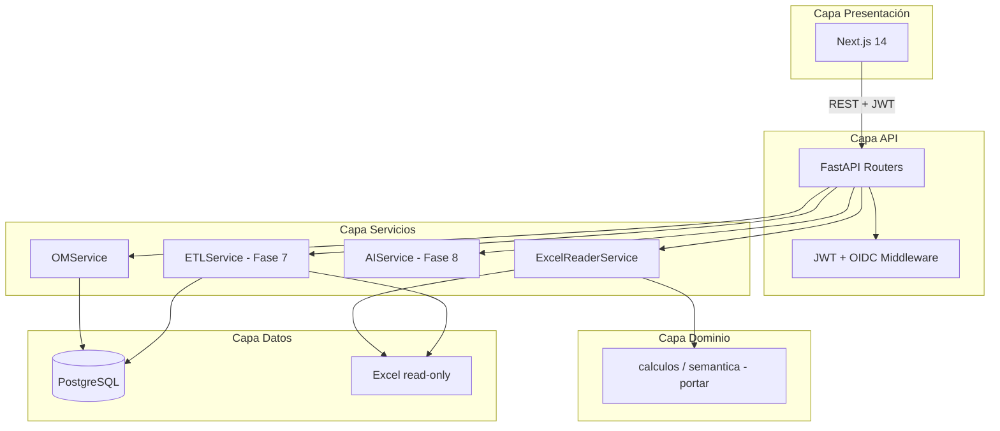

# Arquitectura Lógica — SGIND v2



## ADRs (8/8)

| ADR | Tema | Archivo |
|-----|------|---------|
| 001 | Persistencia Excel + PostgreSQL | `adrs/ADR-001-persistencia.md` |
| 002 | Frontend Next.js 14 | `adrs/ADR-002-frontend.md` |
| 003 | Backend FastAPI | `adrs/ADR-003-backend.md` |
| 004 | Auth Microsoft OIDC + JWT | `adrs/ADR-004-auth.md` |
| 005 | Gráficos Recharts/Plotly.js | `adrs/ADR-005-graficos.md` |
| 006 | Caché React Query + memoria | `adrs/ADR-006-cache.md` |
| 007 | IA Claude API | `adrs/ADR-007-ia.md` |
| 008 | Despliegue Docker/Azure | `adrs/ADR-008-despliegue.md` |

Ver también: [RBAC_MATRIX.md](./RBAC_MATRIX.md)

```
Sistema_Indicadores_Poli/
├── streamlit_app/     ← Sistema actual (sin cambios)
├── core/                ← Legacy Python
├── services/            ← Legacy Python
├── data/                ← Compartido (solo lectura desde v2)
└── sgind-v2/            ← Sistema nuevo (independiente)
    ├── frontend/
    ├── backend/
    └── database/
```
