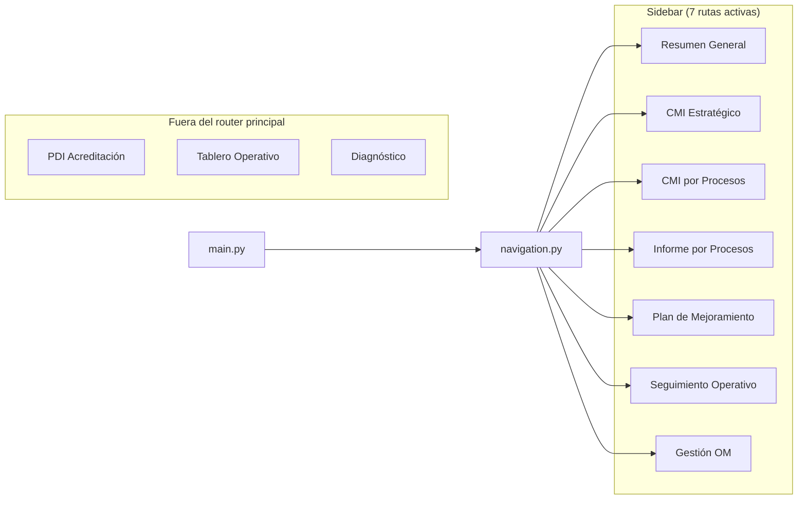
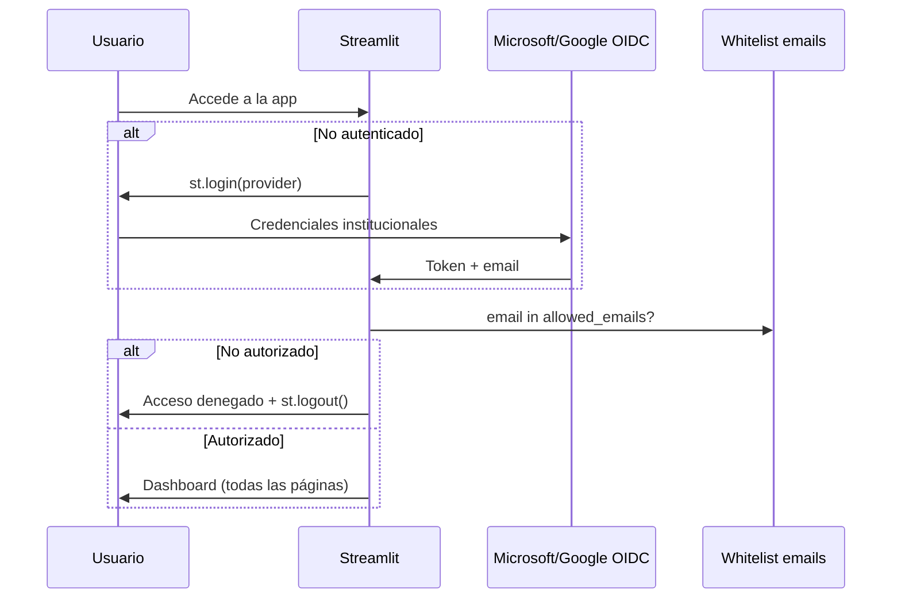

# E0.1 — Documento Funcional del Sistema Actual

**Sistema:** SGIND Streamlit  
**Fecha:** 2026-06-13  
**Fuente:** Código en `streamlit_app/`, `navigation.py`, `main.py`

---

## 1. Mapa de navegación

---

## 2. Páginas activas en sidebar (7)

### 2.1 Resumen General — `resumen_general.py` (~3,107 líneas)

| Aspecto | Detalle |
|---------|---------|
| **Propósito** | Dashboard PDI principal: KPIs, narrativa ejecutiva, sunburst, vistas por segmento |
| **Filtros** | Año; vista segmentada (Indicadores / Proyectos / Retos / Consolidado) |
| **Visualizaciones** | KPI chips, sunburst Plotly, Gantt proyectos, tablas mejorados/riesgo, fichas HTML |
| **Exportaciones** | Excel debug → `artifacts/` (sunburst, columnas) |
| **IA** | Narrativa heurística (`_generate_narrative`) — no Claude directo |
| **Auth** | `require_page_auth()` vía `auth_guard.py` |

### 2.2 CMI Estratégico — `cmi_estrategico_tabulado.py` (~177 líneas, delega a tabs)

| Aspecto | Detalle |
|---------|---------|
| **Propósito** | Balanced Scorecard PDI con 4 tabs |
| **Filtros** | Año corte, corte semestral (Jun/Dic) |
| **Visualizaciones** | Tabs: Resumen KPIs, Líneas, Listado, Alertas; modal ficha |
| **Exportaciones** | Excel vía `tab_listado` |
| **IA** | `analizar_ficha_cmi`, `analizar_linea_cmi` (Claude Haiku + heurística) |

### 2.3 CMI por Procesos — `resumen_por_proceso.py` (~4,207 líneas)

| Aspecto | Detalle |
|---------|---------|
| **Propósito** | Vista por proceso/subproceso con auditoría de calidad |
| **Filtros** | Año, mes, unidad, proceso, subproceso, clasificación, frecuencia (+ topbar global) |
| **Visualizaciones** | Barras Plotly, donuts, cards HTML, tablas paginadas, histórico indicador |
| **Exportaciones** | — |
| **IA** | Análisis texto estándar/heurístico |

### 2.4 Informe por Procesos — `informe_por_procesos.py` (~1,211 líneas)

| Aspecto | Detalle |
|---------|---------|
| **Propósito** | Informe ejecutivo comparativo por proceso |
| **Filtros** | Año, mes, clasificación, frecuencia, unidad, proceso, subproceso |
| **Visualizaciones** | KPIs ejecutivos, comparativo anual Plotly, gauges calidad, tablas críticos |
| **Estado doc** | Marcado 🟡 Beta en documentación interna |

### 2.5 Plan de Mejoramiento — `plan_mejoramiento.py` (~595 líneas)

| Aspecto | Detalle |
|---------|---------|
| **Propósito** | Indicadores CNA + acciones de mejora por factor |
| **Filtros** | Año, corte semestral; factor, característica, búsqueda por nombre |
| **Visualizaciones** | Barras factor, pie niveles, stacked, treemap, barras avance acciones |

### 2.6 Seguimiento Operativo — `seguimiento_reportes.py` (~301 líneas)

| Aspecto | Detalle |
|---------|---------|
| **Propósito** | Tracking mensual de reportes (vencidos / por vencer) |
| **Filtros** | Año, mes, proceso, estado |
| **Visualizaciones** | KPIs, barras Plotly por proceso/estado, tablas alertas |
| **Exportaciones** | Excel (`exportar_excel` + `st.download_button`) |
| **Estado doc** | Marcado 🟡 Beta |

### 2.7 Gestión OM — `gestion_om.py` (~1,639 líneas)

| Aspecto | Detalle |
|---------|---------|
| **Propósito** | CRUD de oportunidades de mejora sobre indicadores en Peligro |
| **Filtros** | Año, mes, proceso, subproceso; selector indicador/acción |
| **Visualizaciones** | KPIs, tablas OM, formularios de registro |
| **Persistencia** | SQLite local o PostgreSQL/Supabase (`registros_om`) |
| **IA** | Import de `analizar_texto_indicador` (diagnóstico timing) |

---

## 3. Páginas fuera del sidebar (objetivo migración: 9 activas)

| Página | Módulo | Líneas | Estado |
|--------|--------|--------|--------|
| PDI Acreditación | `pdi_acreditacion.py` | 361 | Producción/Beta — no en router |
| Tablero Operativo | `tablero_operativo.py` | 1,001 | Beta — no en router |
| Diagnóstico | `diagnostico.py` | 85 | Beta — página standalone `/diagnostico` |

---

## 4. Módulos legacy / alternativos

| Módulo | Líneas | Notas |
|--------|--------|-------|
| `cmi_estrategico.py` | 625 | Vista jerárquica antigua — reemplazada por `_tabulado` |
| `resumen_general_real.py` | 697 | Variante con Consolidado Cierres real — no en router |
| `cmi_por_procesos_resumen.py` | 3 | Alias → `resumen_por_proceso.render()` |

---

## 5. Flujos de usuario por acceso

### 5.1 Autenticación (implementación actual)

> **Nota:** No existen roles diferenciados (Procesos/Calidad/Desempeño) en el código Streamlit actual. Todos los usuarios autorizados ven las mismas 7 páginas.

### 5.2 Flujo típico — Consulta de indicadores

1. Login OIDC → whitelist
2. Resumen General → seleccionar año y vista
3. Filtrar por segmento → explorar sunburst / tablas
4. Deep-link a CMI Estratégico vía `?cmi_linea=` (query param)
5. Registrar OM en Gestión OM si indicador en Peligro

### 5.3 Flujo típico — Gestión OM

1. Gestión OM → filtrar año/mes/proceso
2. Seleccionar indicador en Peligro
3. Registrar tipo acción, número OM, comentario
4. Upsert en `registros_om` (SQLite o PostgreSQL)

---

## 6. Inventario de widgets Streamlit por página

| Widget / patrón | Páginas que lo usan |
|-----------------|---------------------|
| `st.segmented_control` | Resumen General, Resumen General Real |
| `st.selectbox` / `st.multiselect` | Todas las páginas con filtros |
| `st.plotly_chart` | Resumen General, CMI, Informe, Plan, Seguimiento, Tablero, PDI |
| `st.dataframe` / HTML tables | CMI Listado, Gestión OM, Seguimiento |
| `st.download_button` | Seguimiento Reportes, modal ficha (PDF) |
| `st.tabs` | CMI Estratégico (4 tabs) |
| `st.expander` | Varias páginas de detalle |
| `st.form` | Gestión OM (registro) |
| `@st.cache_data` | Loaders de datos en páginas y services |

---

## 7. Tipos de gráficos Plotly identificados

| Tipo | Componente / página |
|------|---------------------|
| Sunburst | `heatmap_chart.py`, Resumen General |
| Treemap | `heatmap_chart.py`, Plan Mejoramiento, PDI |
| Barras / barras apiladas | CMI, Informe, Seguimiento, Tablero |
| Donut / pie | CMI, Tablero Operativo |
| Gauge / bullet | `heatmap_chart.py`, Informe |
| Línea / área histórica | `charts.py`, modal ficha |
| Heatmap | `heatmap_chart.py` |
| Radar | `heatmap_chart.py` |
| Timeline / Gantt | Resumen General (proyectos) |
| Waterfall / treeline | Resumen General (vía sunburst jerárquico) |

**Total:** 10+ tipos de visualización Plotly confirmados.

---

## 8. Gap vs plan de migración

| Requisito plan | Estado actual |
|----------------|---------------|
| 9 páginas activas | 7 en sidebar; 3 adicionales existen pero no están enrutadas |
| 3 roles RBAC | No implementado — solo whitelist |
| 2 Beta | Seguimiento + Diagnóstico documentados; Informe también marcado Beta |
