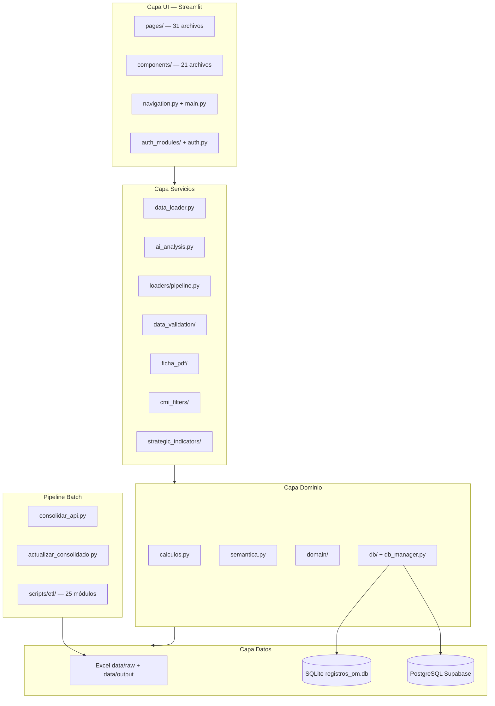

# E0.2 — Documento Técnico del Sistema Actual

**Fecha:** 2026-06-13  
**Método:** Análisis estático del código fuente (no documentación previa)

---

## 1. Arquitectura actual



---

## 2. Métricas de código (verificado)

| Área | Archivos | Líneas |
|------|----------|--------|
| `streamlit_app/` (total) | 76 | 25,776 |
| `streamlit_app/pages/` | 31 | 16,203 |
| `streamlit_app/components/` | 21 | 7,147 |
| `core/` | 19 | 2,592 |
| `services/` | 28 | 4,225 |
| `scripts/etl/` | 25 | 5,534 |
| `scripts/consolidation/` | 21 | 3,772 |
| `tests/` | 49 | 8,914 |
| **Total áreas clave** | **270** | **74,163** |

### Archivos más grandes (deuda de mantenibilidad)

| Archivo | Líneas |
|---------|--------|
| `streamlit_app/pages/resumen_por_proceso.py` | 4,207 |
| `streamlit_app/pages/resumen_general.py` | 3,107 |
| `streamlit_app/pages/gestion_om.py` | 1,639 |
| `streamlit_app/pages/informe_por_procesos.py` | 1,211 |
| `streamlit_app/pages/tablero_operativo.py` | 1,001 |

---

## 3. Dependencias de producción (`requirements.txt`)

| Paquete | Versión | Uso |
|---------|---------|-----|
| streamlit | >=1.40.0 | Framework UI |
| plotly | 5.22.0 | Gráficos interactivos |
| pandas | >=2.3.0,<3.0 | Manipulación datos |
| numpy | >=2.0,<3.0 | Cálculos numéricos |
| openpyxl | 3.1.4 | Lectura/escritura Excel |
| xlrd | 2.0.1 | Excel legacy |
| pyyaml | >=6.0.1 | Data contracts |
| pydantic | >=2.10.0 | Validación schemas |
| kaleido | 0.2.1 | Export Plotly → PNG (PDF) |
| Pillow | >=11.0.0 | Imágenes PDF |
| python-dotenv | 1.0.1 | Variables entorno |
| sqlalchemy | 2.0.23 | ORM BD |
| anthropic | 0.40.0 | API Claude |
| streamlit-option-menu | 0.3.12 | Menú alternativo (legacy) |
| reportlab | 4.0.9 | Generación PDF |
| pypdf | 4.2.0 | Manipulación PDF |
| psycopg2-binary | >=2.9.10 | PostgreSQL |
| xlsxwriter | 3.2.0 | Export Excel |
| tenacity | 8.2.3 | Reintentos ETL |
| tabulate | 0.9.0 | Tablas CLI |

**Total producción:** 20 paquetes

### Dependencias de desarrollo (inferidas de tests)

pytest, pytest-cov, httpx (tests), ruff (si configurado en CI)

---

## 4. Configuración (`config/settings.toml`)

| Sección | Clave | Valor / propósito |
|---------|-------|-------------------|
| `[business]` | `año_cierre` | 2025 — año de cierre actual |
| `[business]` | `ids_plan_anual` | 11 IDs con reglas especiales |
| `[business]` | `ids_tope_100` | IDs con tope 100% |
| `[paths]` | `data_raw` | `data/raw` |
| `[paths]` | `data_output` | `data/output` |
| `[paths]` | `input_fuente_consolidado` | Fuente consolidada entrada |
| `[paths]` | `kawak_dir` | `data/raw/Kawak` |
| `[paths]` | `api_dir` | `data/raw/API` |
| `[pipeline]` | `steps` | consolidar_api → actualizar_consolidado → generar_reporte |
| `[agent]` | `model` | claude-opus-4-6 (agente diagnóstico ETL) |
| `[agent]` | `max_tokens` | 2048 |
| `[schedule]` | `cron` | `0 6 5 * *` (día 5 de cada mes) |

---

## 5. Variables de entorno

| Variable | Ubicación | Propósito |
|----------|-----------|-----------|
| `DATABASE_URL` | `.env` | PostgreSQL Supabase (pooler 6543) |
| `ANTHROPIC_API_KEY` | `.env` / `st.secrets` | API Claude análisis indicadores |
| `client_id` | `st.secrets` | OIDC Microsoft/Google |
| `client_secret` | `st.secrets` | OIDC |
| `auth_provider` | `st.secrets` | Proveedor OIDC (default: microsoft) |
| `allowed_emails` | `st.secrets` | Whitelist acceso |
| `require_email_verified` | `st.secrets` | Validar email verificado |

---

## 6. Módulos `core/` — funciones públicas

| Función | Archivo | Descripción |
|---------|---------|-------------|
| `normalizar_cumplimiento` | `calculos.py` | Normaliza valor a escala estándar |
| `categorizar_cumplimiento` | `calculos.py` / `domain/categorization.py` | Peligro/Alerta/Cumplimiento/Sobrecumplimiento |
| `calcular_salud_institucional` | `calculos.py` | Métrica salud agregada |
| `calcular_tendencia` | `calculos.py` | Tendencia serie temporal |
| `calcular_meses_en_peligro` | `calculos.py` | Meses bajo umbral peligro |
| `generar_recomendaciones` | `calculos.py` | Recomendaciones por categoría |
| `calcular_kpis` | `calculos.py` | KPIs del último corte |
| `guardar_registro_om` | `db/operations.py` | Upsert registro OM |
| `leer_registros_om` | `db/operations.py` | Lista registros OM |
| `registros_om_como_dict` | `db/operations.py` | OM indexados por Id |
| `inicializar_db` | `db/connection_manager.py` | Init SQLite o PostgreSQL |
| `get_database_url` | `db/config_provider.py` | URL BD desde env/secrets |
| `use_postgres` | `db/config_provider.py` | Detecta backend Postgres |
| `semantica.*` | `semantica.py` | Facade re-exporta domain/ + presentation/ |

**Total funciones públicas core:** ~45

---

## 7. Módulos `services/` — funciones públicas

| Función | Archivo | Descripción |
|---------|---------|-------------|
| `cargar_dataset` | `data_loader.py` | Dataset Consolidado Semestral |
| `cargar_dataset_historico` | `data_loader.py` | Consolidado Histórico |
| `cargar_acciones_mejora` | `data_loader.py` | Acciones mejora Excel |
| `cargar_ficha_tecnica` | `data_loader.py` | Ficha técnica indicadores |
| `cargar_om` / `cargar_plan_accion` | `data_loader.py` | OM y planes acción |
| `analizar_texto_indicador` | `ai_analysis.py` | Claude: insights del análisis responsable |
| `analizar_ficha_cmi` | `ai_analysis.py` | Claude/heurística: ficha CMI |
| `analizar_linea_cmi` | `ai_analysis.py` | Claude/heurística: línea estratégica |
| `ejecutar_pipeline_completo` | `loaders/pipeline.py` | Orquestador ETL 5 fases |
| `fase1..fase5_*` | `loaders/pipeline.py` | Fases individuales ETL runtime |
| `filter_df_for_cmi_*` | `cmi_filters/filters.py` | Filtros CMI estratégico/procesos |
| `validate_dataset` | `data_validation/loaders.py` | Valida contra data contract |
| `build_ficha_pdf` | `ficha_pdf/builder.py` | PDF ficha técnica |
| `cargar_mapeos_procesos` | `procesos.py` | Mapa subproceso→proceso |
| `preparar_pdi_con_cierre` | `strategic_indicators/processors.py` | PDI + cumplimiento cierre |
| `load_pdi_catalog` / `load_cna_catalog` | `strategic_indicators/loaders.py` | Catálogos estratégicos |

**Total funciones públicas services:** ~75

---

## 8. Esquema de base de datos

### SQLite / PostgreSQL — `registros_om`

```sql
CREATE TABLE registros_om (
    id                INTEGER/SERIAL PRIMARY KEY,
    id_indicador      TEXT NOT NULL,
    nombre_indicador  TEXT,
    proceso           TEXT,
    periodo           TEXT,
    anio              INTEGER,
    tiene_om          INTEGER DEFAULT 0,
    tipo_accion       TEXT DEFAULT 'OM Kawak',
    numero_om         TEXT,
    comentario        TEXT,
    registrado_por    TEXT DEFAULT '',
    fecha_registro    TEXT,
    UNIQUE(id_indicador, periodo, anio)
);
```

**Backend:** SQLite local (`data/db/registros_om.db`) si no hay `DATABASE_URL`; PostgreSQL Supabase si está configurado.

---

## 9. Patrones de diseño identificados

| Patrón | Ubicación | Descripción |
|--------|-----------|-------------|
| Facade | `core/semantica.py`, `streamlit_app/auth.py` | Re-exporta módulos refactorizados |
| Strategy | `scripts/consolidation/extractors/` | Extractores por tipo de fuente |
| Pipeline | `services/loaders/pipeline.py`, `scripts/etl/` | ETL por fases secuenciales |
| Repository | `core/db/operations.py` | Abstracción acceso OM |
| Cache-aside | `@st.cache_data`, `caching_strategy/` | Caché local/Redis/híbrido |
| Config externalization | `config/settings.toml` | Reglas negocio fuera de código |

---

## 10. Integraciones técnicas

| Integración | Módulo | Protocolo |
|-------------|--------|-----------|
| Kawak API | `scripts/consolidar_api.py` | Excel anual en `data/raw/API/` |
| Kawak manual | `data/raw/Kawak/*.xlsx` | Export manual |
| Claude AI | `services/ai_analysis.py` | REST Anthropic SDK |
| PostgreSQL | `core/db/` | psycopg2 + SQLAlchemy |
| Microsoft OIDC | `auth_modules/guards.py` | `st.login()` nativo Streamlit |
| Agent diagnóstico | `config/settings.toml [agent]` | Claude Opus para fallos ETL |
