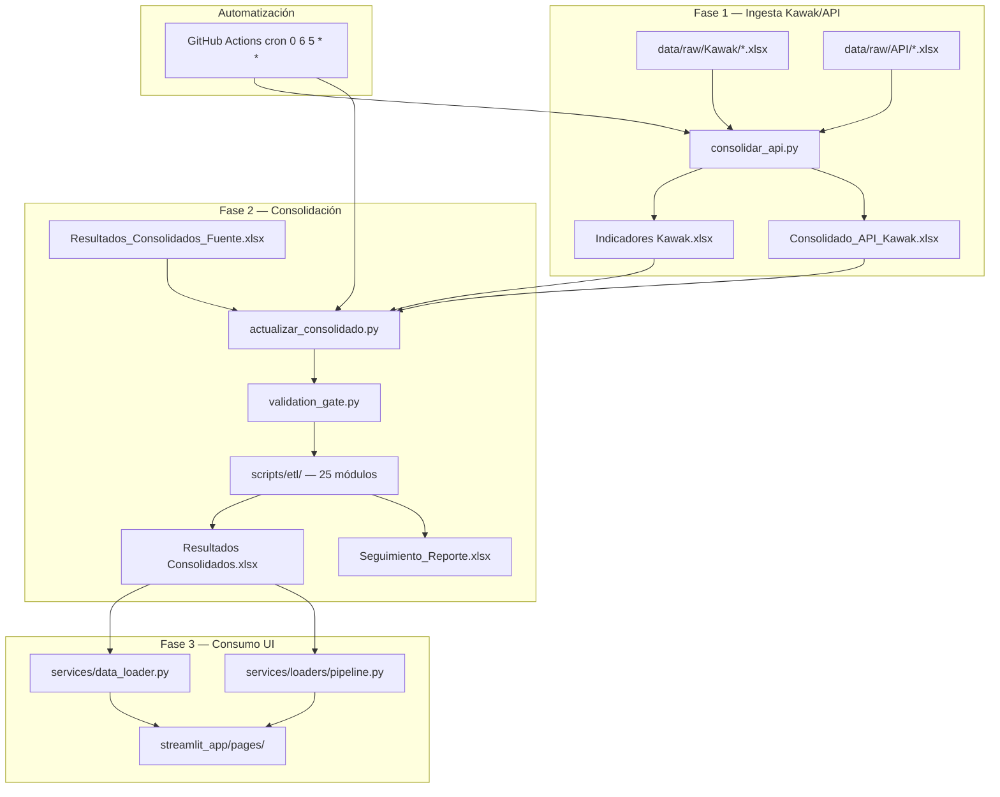
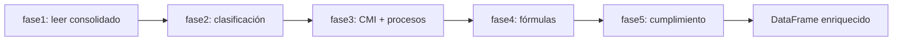
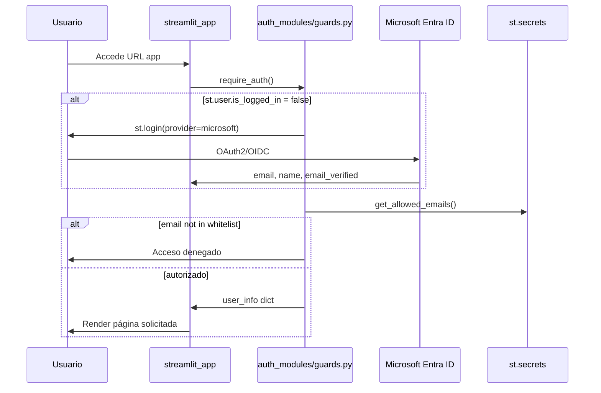
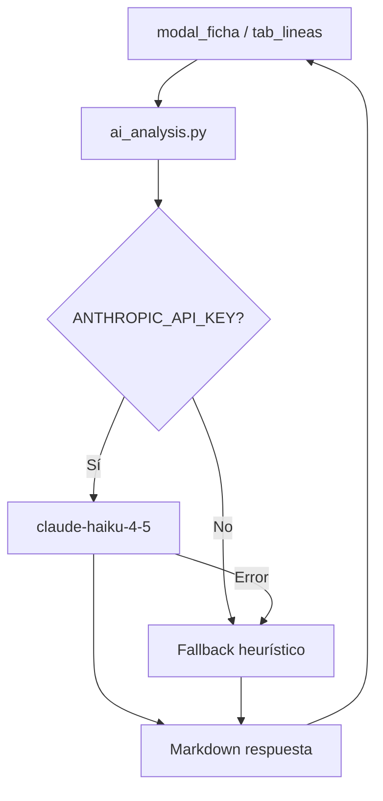

# E0.3 — Mapa de Procesos y Flujos

**Fecha:** 2026-06-13

---

## 1. Pipeline ETL completo (3 fases principales + 5 fases runtime)



---

## 2. Módulos ETL — `scripts/etl/` (25)

| # | Módulo | Responsabilidad |
|---|--------|-----------------|
| 1 | `__init__.py` | Package |
| 2 | `config.py` | Lee `settings.toml` |
| 3 | `extraccion.py` | Extracción datos fuente |
| 4 | `fuentes.py` | Carga fuentes consolidadas |
| 5 | `catalogo.py` | Catálogo indicadores Kawak |
| 6 | `normalizacion.py` | Normalización columnas |
| 7 | `periodos.py` | Normalización períodos |
| 8 | `signos.py` | Sentido indicadores |
| 9 | `no_aplica.py` | Registros "No Aplica" |
| 10 | `desglose.py` | Desglose multiserie |
| 11 | `cumplimiento.py` | Cálculo cumplimiento |
| 12 | `formulas_excel.py` | Reconstrucción fórmulas |
| 13 | `builders.py` | Construcción DataFrames |
| 14 | `escritura.py` | Escritura Excel salida |
| 15 | `workbook_io.py` | I/O workbooks |
| 16 | `purga.py` | Purga registros inválidos |
| 17 | `validacion_historica.py` | Validación histórico |
| 18 | `validation_gate.py` | Gate pre-consolidación |
| 19 | `intermediate_validation.py` | Validación intermedia |
| 20 | `pipeline_metrics.py` | Métricas pipeline |
| 21 | `audit.py` | Auditoría transformaciones |
| 22 | `versioning.py` | Versionado outputs |
| 23 | `notifications.py` | Notificaciones fallos |
| 24 | `retry_handler.py` | Reintentos con tenacity |
| 25 | `agent5_corrections.py` | Correcciones automáticas |

**Duración estimada pipeline:** ~45-50 segundos (según plan de migración)

---

## 3. Pipeline runtime — `services/loaders/pipeline.py` (5 fases)



| Fase | Función | Entrada | Salida |
|------|---------|---------|--------|
| 1 | `fase1_leer_consolidado_semestral` | Excel path | DataFrame base |
| 2 | `fase2_enriquecer_clasificacion` | DF + Excel clasificación | DF + columnas clasificación |
| 3 | `fase3_enriquecer_cmi_y_procesos` | DF | DF + flags CMI + proceso padre |
| 4 | `fase4_reconstruir_columnas_formula` | DF | DF + columnas calculadas |
| 5 | `fase5_aplicar_calculos_cumplimiento` | DF | DF + cumplimiento + nivel |

---

## 4. Flujo de autenticación Microsoft OIDC



---

## 5. Flujo de datos Excel → Dashboard

```mermaid
flowchart LR
    RC[Resultados Consolidados.xlsx] --> CDS[cargar_dataset]
    CDS --> CACHE[@st.cache_data]
    CACHE --> FILTER[Filtros página]
    FILTER --> CALC[core/calculos.py]
    CALC --> VIZ[Plotly / HTML]
    OMDB[(registros_om)] --> GOM[gestion_om.py]
    GOM --> VIZ
```

---

## 6. Flujo IA — Análisis CMI



---

## 7. Procesos institucionales mapeados (14)

| # | Proceso | Página principal | Fuente datos |
|---|---------|------------------|--------------|
| 1 | Consulta ejecutiva PDI | Resumen General | Consolidado Semestral |
| 2 | CMI estratégico | CMI Estratégico | PDI + Cierres |
| 3 | CMI por procesos | CMI por Procesos | Consolidado + mapa procesos |
| 4 | Informe por procesos | Informe por Procesos | Consolidado + propuestas |
| 5 | Plan de mejoramiento CNA | Plan de Mejoramiento | CNA + acciones |
| 6 | Seguimiento reportes | Seguimiento Operativo | Seguimiento_Reporte.xlsx |
| 7 | Gestión OM | Gestión OM | Consolidado + registros_om |
| 8 | Acreditación PDI | PDI Acreditación | Matriz acreditación |
| 9 | Tablero operativo N3 | Tablero Operativo | Consolidado + QC |
| 10 | Ingesta Kawak | consolidar_api.py | API + Kawak Excel |
| 11 | Consolidación mensual | actualizar_consolidado.py | Fuente + API |
| 12 | Validación datos | data_validation/ | data_contracts.yaml |
| 13 | Exportación ficha PDF | ficha_pdf/ | Ficha técnica + histórico |
| 14 | Diagnóstico sistema | diagnostico.py | Smoke test imports |
