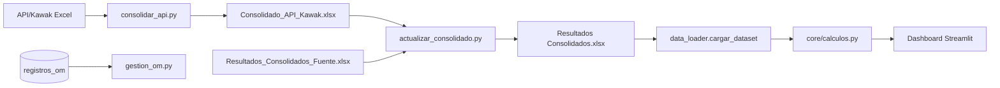

# E0.5 — Catálogo de Fuentes de Datos

**Fecha:** 2026-06-13  
**Método:** Inventario filesystem + `config/settings.toml` + `config/data_contracts.yaml` + `services/data_loader.py`

---

## Resumen

| Categoría | Cantidad plan | Cantidad real |
|-----------|---------------|---------------|
| Excel raw | 33 | **27** |
| Excel output | 15 | **8** (+ 2 versiones en `.versiones/`) |
| Bases de datos | 2 | **2** (SQLite + PostgreSQL opcional) |
| Contratos YAML | — | **1** (`data_contracts.yaml`) |

---

## 1. Fuentes Excel — `data/raw/` (27 archivos)

| # | Ruta | Consumidor principal | Hojas clave | Frecuencia |
|---|------|---------------------|-------------|------------|
| 1 | `acciones_mejora.xlsx` | `data_loader.cargar_acciones_mejora` | Acciones | Manual |
| 2 | `API/2022.xlsx` | `consolidar_api.py` | Resultados API | Mensual/auto |
| 3 | `API/2023.xlsx` | `consolidar_api.py` | Resultados API | Mensual/auto |
| 4 | `API/2024.xlsx` | `consolidar_api.py` | Resultados API | Mensual/auto |
| 5 | `API/2025.xlsx` | `consolidar_api.py` | Resultados API | Mensual/auto |
| 6 | `API/2026.xlsx` | `consolidar_api.py` | Resultados API | Mensual/auto |
| 7 | `Auditoria/auditoria_resultado.xlsx` | Auditoría ETL | Resultados | Manual |
| 8 | `Dataset_Unificado.xlsx` | Legacy/exploratorio | Varias | Manual |
| 9 | `Ficha_Tecnica_Indicadores.xlsx` | `cargar_ficha_tecnica` | Ficha | Manual |
| 10 | `Fuentes Consolidadas/Consolidado_API_Kawak.xlsx` | `actualizar_consolidado.py`, dashboards | Datos API | Post-consolidar_api |
| 11 | `Fuentes Consolidadas/Consolidado_API_Kawak_REV.xlsx` | Revisión manual | Datos API | Manual |
| 12 | `Fuentes Consolidadas/Indicadores Kawak.xlsx` | `catalogo.py`, filtros CMI | Catálogo | Post-consolidar_api |
| 13 | `Indicadores por CMI.xlsx` | CMI filters | Worksheet | Manual |
| 14 | `Kawak/2022.xlsx` | `consolidar_api.py` | Export Kawak | Manual |
| 15 | `Kawak/2023.xlsx` | `consolidar_api.py` | Export Kawak | Manual |
| 16 | `Kawak/2024.xlsx` | `consolidar_api.py` | Export Kawak | Manual |
| 17 | `Kawak/2025.xlsx` | `consolidar_api.py` | Export Kawak | Manual |
| 18 | `Kawak/2026.xlsx` | `consolidar_api.py` | Export Kawak | Manual |
| 19 | `Monitoreo/Monitoreo_Informacion_Procesos 2025.xlsx` | Monitoreo procesos | Seguimiento | Manual |
| 20 | `OM.xlsx` | `cargar_om` | OM | Manual |
| 21 | `Plan de accion/PA_1.xlsx` | `cargar_plan_accion` | Plan acción | Manual |
| 22 | `Plan de accion/PA_2.xlsx` | `cargar_plan_accion` | Plan acción | Manual |
| 23 | `Propuesta Indicadores/Indicadores Propuestos.xlsx` | `informe_por_procesos` | Propuestas | Manual |
| 24 | `Resultados_Consolidados_Fuente.xlsx` | `actualizar_consolidado.py` | Fuente entrada | Pre-ETL |
| 25 | `Retos/Plan de retos.xlsx` | Resumen General (retos) | Retos | Manual |
| 26 | `salidas_no_conformes.xlsx` | Calidad | NC | Manual |
| 27 | `Subproceso-Proceso-Area.xlsx` | `procesos.cargar_mapeos_procesos` | Mapa procesos | Manual |

---

## 2. Fuentes Excel — `data/output/` (8 archivos)

| # | Ruta | Consumidor | Hojas requeridas | Generado por |
|---|------|------------|------------------|--------------|
| 1 | `Resultados Consolidados.xlsx` | **Fuente principal** — todas las páginas dashboard | Consolidado Historico, Semestral, Cierres, Catalogo | `actualizar_consolidado.py` |
| 2 | `Resultados Consolidados VALORES.xlsx` | Debug/validación | Varias | Manual |
| 3 | `Resultados Consolidados.bak.xlsx` | Backup | Varias | Automático |
| 4 | `Seguimiento_Reporte.xlsx` | `seguimiento_reportes.py` | Tracking Mensual | ETL |
| 5 | `Matriz_Indicadores_Gestion_Riesgos.xlsx` | Riesgos | Matriz | Manual |
| 6 | `Claude/Consolidado_PDI_20260313_0147.xlsx` | Export IA | PDI | Manual |
| 7 | `.versiones/*_pre_consolidacion.xlsx` | Versionado ETL | Snapshot | `versioning.py` |
| 8 | (artefactos en `artifacts/`) | Reportes pipeline | JSON/CSV | `generar_reporte.py` |

---

## 3. Data Contracts (`config/data_contracts.yaml`)

| Fuente contract | Archivo | Hojas definidas |
|-----------------|---------|-----------------|
| `resultados_consolidados` | `data/output/Resultados Consolidados.xlsx` | Consolidado Historico, Semestral, Cierres, Catalogo |
| `seguimiento_reporte` | `data/output/Seguimiento_Reporte.xlsx` | Tracking Mensual |
| `consolidado_api_kawak` | `data/raw/Fuentes Consolidadas/Consolidado_API_Kawak.xlsx` | Datos API |
| `ficha_tecnica` | `data/raw/Ficha_Tecnica_Indicadores.xlsx` | Ficha |
| `acciones_mejora` | `data/raw/acciones_mejora.xlsx` | Acciones |

**Validador:** `services/data_validation/` — `validate_dataset()`, `validate_all_sources()`

---

## 4. Bases de datos

| BD | Ubicación | Tablas | Operaciones |
|----|-----------|--------|-------------|
| SQLite | `data/db/registros_om.db` | `registros_om` | CRUD OM (default sin DATABASE_URL) |
| PostgreSQL | Supabase (env `DATABASE_URL`) | `registros_om` | CRUD OM (producción) |

### Esquema `registros_om`

| Columna | Tipo | Constraint |
|---------|------|------------|
| id | INTEGER/SERIAL | PK |
| id_indicador | TEXT | NOT NULL |
| nombre_indicador | TEXT | — |
| proceso | TEXT | — |
| periodo | TEXT | — |
| anio | INTEGER | — |
| tiene_om | INTEGER | DEFAULT 0 |
| tipo_accion | TEXT | DEFAULT 'OM Kawak' |
| numero_om | TEXT | — |
| comentario | TEXT | — |
| registrado_por | TEXT | — |
| fecha_registro | TEXT | — |
| — | UNIQUE | (id_indicador, periodo, anio) |

---

## 5. Integración Kawak API

| Aspecto | Detalle |
|---------|---------|
| **Origen** | Export JSON/Excel → `data/raw/API/{año}.xlsx` |
| **Consolidador** | `scripts/consolidar_api.py` |
| **Salida** | `Consolidado_API_Kawak.xlsx`, `Indicadores Kawak.xlsx` |
| **Período** | 2022–2026 |
| **Frecuencia** | Mensual (cron día 5) + manual |
| **Campos clave** | ID, fecha, resultado, análisis, variables |

---

## 6. Trazabilidad fuente → indicador → dashboard

---

## 7. Volumen de datos

| Métrica | Valor |
|---------|-------|
| Registros consolidados | ~100,000+ (según plan) |
| Indicadores únicos | ~500+ activos (post-exclusiones) |
| Período histórico | 2022–2026 (algunos desde 2018 en raw) |
| Usuarios | ~100 total, ~40 mensuales |
