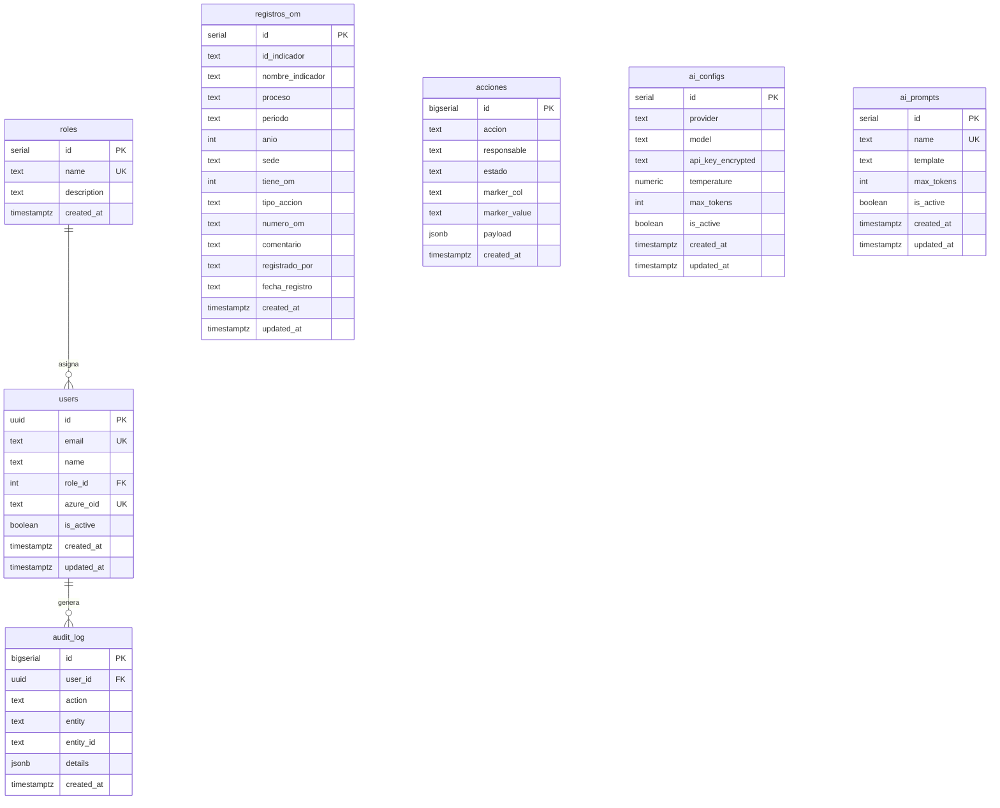

# E2.1 — Diagrama Entidad-Relación

## Matriz de cobertura entidades

| Entidad plan | Tabla PG | Fuente legacy | Estado |
|--------------|----------|---------------|--------|
| User | `users` | Nuevo OIDC | ✅ |
| Role | `roles` | Nuevo RBAC | ✅ |
| RegistroOM | `registros_om` | SQLite | ✅ |
| Accion | `acciones` | SQLite (dinámico) | ✅ |
| AuditLog | `audit_log` | Nuevo + trigger | ✅ |
| AIConfig | `ai_configs` | Nuevo | ✅ |
| AIPrompt | `ai_prompts` | Seed PT-01..03 | ✅ |
| Indicadores Excel | — | Excel read-only | ✅ (fuera de PG) |

## Cardinalidades

| Relación | Cardinalidad | Notas |
|----------|--------------|-------|
| Role → User | 1:N | Un usuario tiene un rol |
| User → AuditLog | 1:N | user_id nullable (sistema) |
| RegistroOM | — | UNIQUE(id_indicador, periodo, anio) |
| Acciones | — | Sin FK; marker para bulk delete |

## Normalización

- **3NF** en tablas `users`, `roles`, `registros_om`, `ai_*`
- `acciones.payload` (JSONB) almacena columnas dinámicas legacy sin romper esquema
